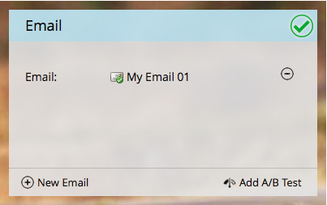

# Välj en befintlig e-postadress {#choose-an-existing-email}

>[!PREREQUISITES]
>
>* [Skapa ett e-postprogram](/help/marketo/product-docs/email-marketing/email-programs/creating-an-email-program/create-an-email-program.md)
>* [Definiera en målgrupp med en smart ](/help/marketo/product-docs/email-marketing/email-programs/managing-people-in-email-programs/define-an-audience-with-a-smart-list.md) lista  [Definiera en målgrupp genom att importera en lista](/help/marketo/product-docs/email-marketing/email-programs/managing-people-in-email-programs/define-an-audience-by-importing-a-list.md)

När du har [skapat ett e-postprogram](/help/marketo/product-docs/email-marketing/email-programs/creating-an-email-program/create-an-email-program.md) och definierat målgruppen, vill du bestämma vilken e-postadress du ska skicka. Du kan [skapa ett e-postmeddelande för ett e-postprogram](/help/marketo/product-docs/email-marketing/email-programs/email-program-actions/create-an-email-for-an-email-program.md) från grunden eller välja ett som redan finns. Så här väljer du en som redan finns.

1. Gå till **Marknadsföringsaktiviteter**.

   

1. Hitta och välj e-postprogram.

   

1. Under rutan **E-post** markerar du den du vill skicka.

   

   >[!NOTE]
   >
   >Endast lokala e-postmeddelanden kan väljas. Behöver du flytta ett e-postmeddelande från ett program till ett annat? [Läs mer här](/help/marketo/product-docs/email-marketing/email-programs/email-program-actions/move-an-email.md).

   Söt!

   

Nu när vi har bestämt vilka e-postmeddelanden vi ska skicka kan vi konfigurera ett A/B-test eller hoppa över det och schemalägga e-postprogrammet.

>[!MORELIKETHIS]
>
>* [Lägg till ett A/B-test](/help/marketo/product-docs/email-marketing/email-programs/email-program-actions/email-test-a-b-test/add-an-a-b-test.md)
>* [Schemalägg ditt e-postprogram](/help/marketo/product-docs/email-marketing/email-programs/email-program-actions/schedule-your-email-program.md)

