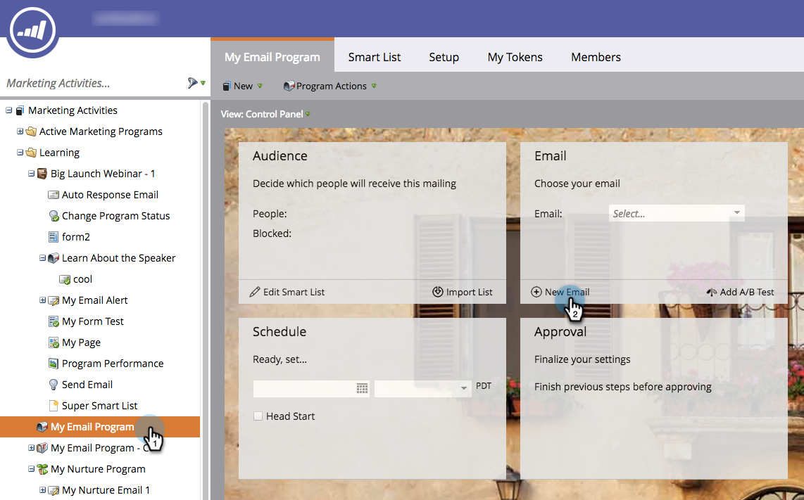

# Skapa ett e-postmeddelande för ett e-postprogram {#create-an-email-for-an-email-program}

>[!NOTE]
>
>**Förutsättningar**
>
>* [Skapa ett e-postprogram](/help/marketo/product-docs/email-marketing/email-programs/creating-an-email-program/create-an-email-program.md)
>* [Definiera en publik med en smart lista](/help/marketo/product-docs/email-marketing/email-programs/managing-people-in-email-programs/define-an-audience-with-a-smart-list.md) eller [Definiera en publik genom att importera en lista](/help/marketo/product-docs/email-marketing/email-programs/managing-people-in-email-programs/define-an-audience-by-importing-a-list.md)

>

När du har skapat e-postprogrammet och definierat målgruppen, vill du bestämma vilket e-postmeddelande du ska skicka. Du kan [välja ett befintligt e-postmeddelande](choose-an-existing-email.md) eller skapa ett från början. Så här skapar du ett nytt e-postmeddelande.

1. Gå till **marknadsföringsaktiviteter**.

   

1. Välj e-postprogram. Klicka på **Ny e-post** under rutan **E-post**.

   

1. Ange ett **namn**, markera önskad mall och klicka på **Skapa**.

   

1. Gör alla ändringar du vill och stäng av redigeraren.

   

   >[!NOTE]
   >
   >Lär dig hur du [redigerar element i ett e-postmeddelande](/help/marketo/product-docs/email-marketing/general/email-editor-2/edit-elements-in-an-email.md).

1. Glöm inte att godkänna e-postmeddelandet.

   

Bra! Nu när vi har skapat ett e-postmeddelande som vi vill skicka kan vi [lägga till ett A/B-test](email-test-a-b-test/add-an-a-b-test.md) eller hoppa direkt till att [schemalägga e-postprogrammet](schedule-your-email-program.md).

>[!MORELIKETHIS]
>
>* [Lägg till ett A/B-test](email-test-a-b-test/add-an-a-b-test.md)
>* [Schemalägg ditt e-postprogram](schedule-your-email-program.md)

