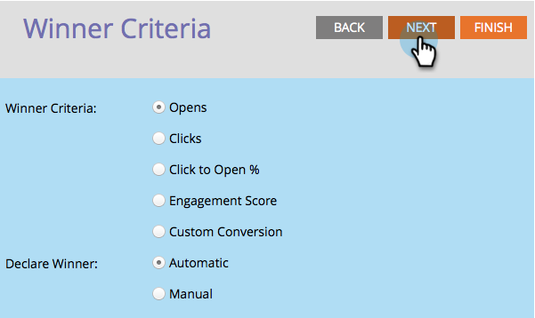

# Definiera villkor för A/B-testvinnare {#define-the-a-b-test-winner-criteria}

När du [lägger till ett A/B-test](add-an-a-b-test.md) i e-postprogrammet måste du välja testtyp, [schemalägga A/B-testet](schedule-the-a-b-test.md)och sedan definiera vinnarkriterierna. Så här avgör du vilket e-postmeddelande som vinner.

>[!PREREQUISITES]
>
>* [Lägg till ett A/B-test](add-an-a-b-test.md)

>

## Vinnarvillkor {#winner-criteria}

1. Standardalternativen för **vinnarvillkor** visas först.

   

   | **Öppnar** | En öppen registrerar när bilder hämtas till ett e-postmeddelande. Även om du inte inkluderar en bild infogar Marketo som standard en enda spårningspixel i alla HTML-e-postmeddelanden. |
   |---|---|
   | **Klickningar** | Som standard är länkar i e-postmeddelanden inbäddade i spårning, vilket gör att du kan se vem som klickade på länken, hur många länkar som klickades osv. |
   | **Klicka för att öppna %** | Procentandel e-postmeddelanden som öppnades och där en länk klickades i e-postmeddelandet. Detta mäter relevansen och sammanhanget för ett e-postmeddelande genom att ta antalet unika klick dividerat med antalet unika öppningar och sedan multiplicera med 100 för att visa det som en procentandel. |
   | **Engagement Score** | Med hjälp av [engagemangspoängen](http://docs.marketo.com/display/DOCS/Understanding+the+Engagement+Score) kan ni avgöra hur effektivt ert innehåll är. |

   >[!TIP]
   >
   >Om du väljer Engagement Score måste testet köras i minst 24 timmar. Läs mer om hur du [förstår poängen](../../../../../product-docs/email-marketing/drip-nurturing/reports-and-notifications/understanding-the-engagement-score.md)för engagemang.

   Du kan också anpassa villkoren genom att välja Anpassad konvertering och klicka på Redigera.
   

   >[!NOTE]
   >
   >Med anpassad konvertering kan du välja vilken händelse som helst som en konvertering genom att använda utlösare och filter.

   Ett fönster öppnas. Hitta den utlösare du vill ha och dra den till arbetsytan.
   

   >[!NOTE]
   >
   >**Djupdykning**
   >
   >
   >Läs mer om [smarta listor och statiska listor](http://docs.marketo.com/display/docs/smart+lists+and+static+lists).

   Definiera utlösaren.
   

   >[!NOTE]
   >
   >Marketo tillåter endast utlösare för personer som har fått e-postmeddelandet från det här e-postprogrammet. Du behöver inte lägga till filtret&quot;Skickat e-post&quot;.

   Klicka på Stäng.
   

   Bra! Nu är det dags att bestämma hur vinnaren ska vara bestämd.

## Deklarera vinnare {#declare-winner}

1. Välj ett av de två tillgängliga alternativen.

   

   >[!NOTE]
   >
   >**Påminnelse**
   >
   >
   >Om du gör ett A/B-test för **datum/tid** kan du bara välja **Manuell**.

   När A/B-testet är klart kan Marketo automatiskt skicka det vinnande e-postmeddelandet vid den schemalagda tidpunkten, eller så kan du granska resultatet och bestämma när e-postmeddelandet ska skickas.

1. Automatiskt är grymt och är standardalternativet. Klicka bara på **Nästa**.

   

   >[!TIP]
   >
   >Om du väljer **Manuell** skickas testet ut och du väntar på att du ska deklarera en vinnare. Du får en rapport över resultaten.

   [schemalägg A/B-testet](schedule-the-a-b-test.md)

Perfekt! Nu kör vi.