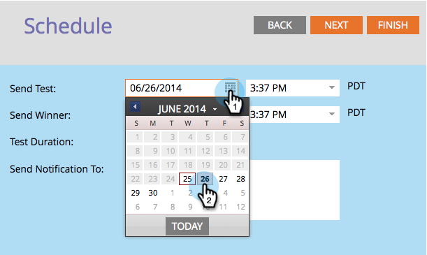

# Schemalägg A/B-testet {#schedule-the-a-b-test}

När du har lagt till ett A/B-test i ett e-postprogram och definierat vinnarkriterierna måste du schemalägga när testet börjar. Så här gör du.

>[!PREREQUISITES]
>
>[Lägg till ett A/B-test](/help/marketo/product-docs/email-marketing/email-programs/email-program-actions/email-test-a-b-test/add-an-a-b-test.md)

>[!NOTE]
>
>För datum-/tidstester behöver du bara ange när du får sammanfattningen av testresultaten.

1. Välj **Skicka test** datum.

1. Välj **Skicka test** tid.

   

   >[!NOTE]
   >
   >Sändnings- och sändningsvinnaren måste vara minst fyra timmars ifrån. För större utskick kanske du vill vänta i 24 timmar så att du hinner uppnå bra resultat.

1. Gör samma sak för **Skicka vinnare**. Ange meddelandemottagare (valfritt) och klicka på **Nästa**.

   >[!NOTE]
   >
   >Endast testgruppen får testvarianterna.

   

   >[!NOTE]
   >
   >Om du väljer att deklarera en vinnare manuellt definierar du **Skicka rapport** datum/tid i stället för **Slutför utskick** datum/tid.

   Suverän! Nu är du klar. Granska sammanfattningen och klicka på Stäng.

   

   Du kommer att märka **Schema** Panelen har uppdaterats.

   

   >[!NOTE]
   >
   >När du schemalägger ett A/B-test konfigureras även det sista sändningsdatumet eller rapportens sändningsdatum.

   Om du redan har definierat målgruppen och valt ett e-postmeddelande är det enda steget kvar att godkänna programmet.

   >[!MORELIKETHIS]
   >
   >[Godkänn/avgodkänn ett e-postprogram](/help/marketo/product-docs/email-marketing/email-programs/email-program-actions/approve-unapprove-an-email-program.md)
