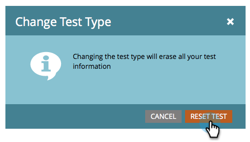
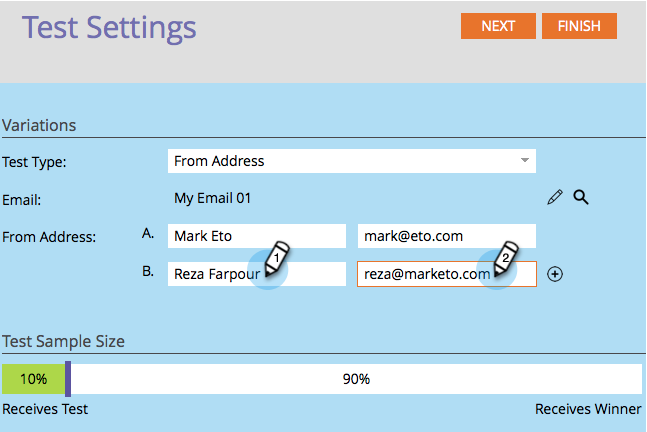

# Använd A/B-testning från adress {#use-from-address-a-b-testing}

Du kan enkelt A/B-testa dina e-postmeddelanden. Ett intressant test är **From Address** -testet. Så här ställer du in det.

>[!NOTE]
>
>**Förutsättningar**
>
>* [Lägg till ett A/B-test](add-an-a-b-test.md)

>

1. Under rutan **E-post** , med e-postmeddelandet markerat, klickar du på **Lägg till A/B-test**.

   

1. Ett nytt fönster öppnas. Välj **Från adress** som **testtyp**.

   

1. Om du har tidigare testinformation (till exempel ett ämnestest) kan du klicka på **Återställ test**.

   

1. Ange den andra **informationen från adressen** som du vill testa.

   >[!NOTE]
   >
   >Alternativ A fylls i automatiskt med informationen i det valda e-postmeddelandet.

   

   >[!TIP]
   >
   >Du kan klicka på **plustecknet** för att lägga till så många från adresser du vill.

1. Använd reglaget för att välja hur stor procentandel av publiken du vill ha i A/B-testet och klicka på **Nästa**.

   

   >[!NOTE]
   >
   >De olika variationerna skickas till lika delar av den valda provstorleken.

   >[!CAUTION]
   >
   >**Vi rekommenderar att du inte anger 100 %** som provstorlek. Om du använder en statisk lista skickas e-postmeddelandet till alla i målgruppen om du anger att exempelstorleken ska vara 100 %, och vinnaren går inte till någon. Om du använder en **smart** lista skickas e-postmeddelandet till alla i målgruppen *vid den tidpunkten om du anger 100 % för exempelstorleken. *När e-postprogrammet körs igen vid ett senare tillfälle kommer alla nya personer som är kvalificerade för den smarta listan också att få e-postmeddelandet eftersom de nu ingår i målgruppen.

   Vi är nästan framme. Nu måste vi [definiera kriterierna](define-the-a-b-test-winner-criteria.md)för A/B-testvinnare.

   >[!NOTE]
   >
   >**Relaterade artiklar**
   >
   >    
   >    
   >    * [Definiera villkor för A/B-testvinnare](define-the-a-b-test-winner-criteria.md)

