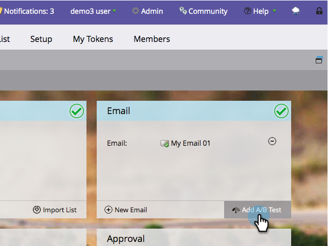

# Använd A/B-testning på ämnesraden {#use-subject-line-a-b-testing}

Du kan enkelt A/B-testa dina e-postmeddelanden. Ett av de vanligaste testerna är **ämnesraden** .

>[!NOTE]
>
>**Förutsättningar**
>
>* [Lägg till ett A/B-test](add-an-a-b-test.md)

>

1. Klicka på Lägg till A/B-test under rutan E-post med ditt e-postmeddelande markerat.

1. Testredigeringsfönstret öppnas. Ange en eller flera nya ämnesrader.

   >[!NOTE]
   >
   >Välj** A**** **fylls i automatiskt med informationen i det valda e-postmeddelandet.

   

   >[!TIP]
   >
   >Du kan klicka på **plustecknet****** för att lägga till fler ämnesrader.

1. Använd reglaget för att välja hur stor procentandel av publiken du vill ska få A/B-testet och klicka på **Nästa**.

   

   >[!CAUTION]
   >
   >**Vi rekommenderar att du inte anger 100 %** som provstorlek. Om du använder en statisk lista och anger 100 % som exempelstorlek skickas e-postmeddelandet till alla i målgruppen och vinnaren går inte till någon. Om du använder en smart lista skickar du e-postmeddelandet till alla i målgruppen *vid den tidpunkten genom att ange samplingsstorleken till 100 %. *Och när e-postprogrammet körs igen vid ett senare tillfälle får alla nya personer som är kvalificerade för den smarta listan också e-postmeddelandet eftersom de nu är inkluderade i målgruppen.

   >[!NOTE]
   >
   >De olika variationerna av motivet tar jämna delar av den valda provstorleken.

   Vi är nästan framme. Nu måste vi [definiera kriterierna](define-the-a-b-test-winner-criteria.md)för A/B-testvinnare.

   >[!NOTE]
   >
   >**Relaterade artiklar**
   >
   >    
   >    
   >    * [Definiera villkor för A/B-testvinnare](define-the-a-b-test-winner-criteria.md)

