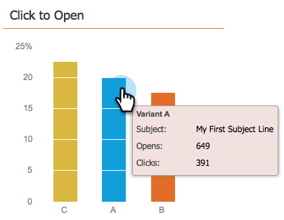

# Använd kontrollpanelen för e-postprogram - A/B-testvy {#use-the-email-program-dashboard-a-b-test-view}

Ta reda på hur ditt [e-postprogram A/B test](/help/marketo/product-docs/email-marketing/email-programs/email-program-actions/email-test-a-b-test/add-an-a-b-test.md) fungerar med den här instrumentpanelen.

## Skicka test {#send-test}

Här ser du det totala antalet levererade och uppdelade efter varianter.

## Klicka {#clicks}

Här ser du hur många klick varje variant har.

## Klicka för att öppna {#click-to-open}

I det här diagrammet visas hur du klickar för att öppna förhållandet. (# klickningar / # öppnas).

## Sammanfattning {#summary}

Här ser du en beskrivning av antalet klickningar och avbeställningar per variant för enkel jämförelse.

Cool Dashboard, tycker du inte?

>[!MORELIKETHIS]
>
>[Använda kontrollpanelen för e-postprogram](/help/marketo/product-docs/email-marketing/email-programs/email-program-data/use-the-email-program-dashboard.md)
