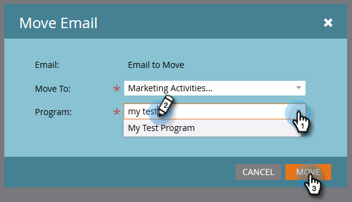

# Flytta ett e-postmeddelande {#move-an-email}

Behöver du flytta ett e-postmeddelande från ett program till ett annat? Så här gör du.

1. Gå till **Marknadsföringsaktiviteter**.

   

1. Leta reda på e-postmeddelandet som du vill flytta, högerklicka på det och välj **Flytta**.

   

1. Klicka på listrutan **Flytta till** och välj **Marknadsföringsaktiviteter**.

   

   >[!NOTE]
   >
   >I det här exemplet flyttar vi ett e-postmeddelande till ett annat program, men du kan också flytta ett e-postmeddelande till en mapp i Design Studio.

1. Klicka på listrutan **Program**, sök efter och välj målprogrammet och klicka på **Flytta**.

   

   Du kommer att se ditt e-postmeddelande nu finnas i det andra programmet.

   

   Ganska fet!
