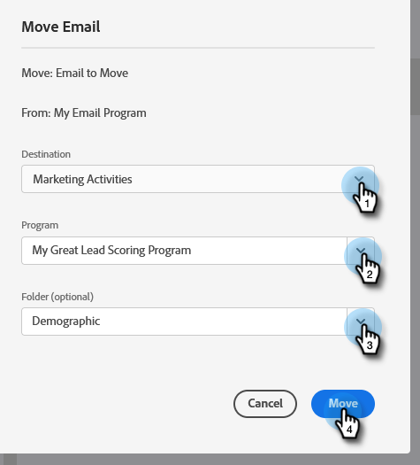
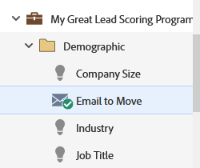

# Flytta ett e-postmeddelande {#move-an-email}

Behöver du flytta ett e-postmeddelande från ett program till ett annat? Så här gör du.

1. Gå till **[!UICONTROL Marketing Activities]**.

   

1. Leta reda på e-postmeddelandet som du vill flytta, högerklicka på det och välj **[!UICONTROL Move]**.

   

1. Välj **[!UICONTROL Destination]**, **[!UICONTROL Program]** och valfritt **[!UICONTROL Folder]**. Välj **[!UICONTROL Move]**.

   

   >[!NOTE]
   >
   >I det här exemplet flyttar vi ett e-postmeddelande till ett annat program, men du kan också flytta ett e-postmeddelande till en mapp i [!UICONTROL Design Studio].

   Du kommer att se ditt e-postmeddelande nu finnas i det andra programmet.

   

   >[!NOTE]
   >
   >Du kan också dra och släppa e-postmeddelandet till ett nytt mål i trädet.
