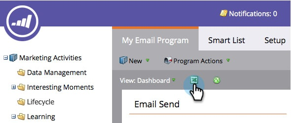

# Exportera kontrollpanelen för e-postprogram till Excel {#export-email-program-dashboard-to-excel}

När du har kört ett e-postprogram och har data på kontrollpanelen kan du exportera rådata till Excel för ytterligare analys. Så här gör du.

1. Gå till **Marknadsföringsaktiviteter**.

   

1. Hitta och välj e-postprogram.

   

   >[!NOTE]
   >
   >Om ditt e-postprogram inte har startats ännu visas ingen instrumentpanel eftersom det inte finns några data att se.

1. Klicka bara på Excel-ikonen så börjar exporten.

   

   Ganska lätt, eller hur?
