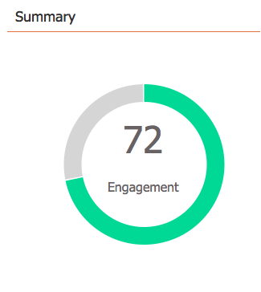

# Använda kontrollpanelen för e-postprogram {#use-the-email-program-dashboard}

Se hur era [e-postprogram](http://docs.marketo.com/display/docs/email+programs) fungerar i den här instrumentpanelsvyn.

>[!NOTE]
>
>Om ditt program har ett A/B-test går du till [e-postprogrammets kontrollpanel - A/B-testvy](../../../../product-docs/email-marketing/email-programs/email-program-actions/email-test-a-b-test/use-the-email-program-dashboard-a-b-test-view.md).

>[!NOTE]
>
>Alla data i den här vyn är aggregerade (omfattar A/B-test samt det slutliga e-postmeddelandet).

## Skicka e-post {#email-send}

Här ser du hur många mejl som har skickats, studsat och levererats.

>[!NOTE]
>
>På grund av standarder för e-postleverans som ligger utanför Marketos kontroll är statistiken Student and Delivers ungefärlig, inte exakt.

## Öppnar/klickar {#opens-clicks}

I det här diagrammet visas antalet e-postmeddelanden som öppnas/klickas under specifika tidsperioder efter att e-postprogrammet har körts.

>[!TIP]
>
>Lägg märke till hur många öppningar/klick som minskar allt eftersom tiden går.

## Sammanfattning - engagemang {#summary-engagement}

Detta visar er den övergripande [engagemangspoängen](../../../../product-docs/email-marketing/drip-nurturing/reports-and-notifications/understanding-the-engagement-score.md).

## Sammanfattning - resten {#summary-rest}

Resten av informationen visar Öppna, Klickningar, Klick/Öppna förhållande och Avbeställ.

>[!TIP]
>
>Frekvensen **för att avbryta prenumerationen** i exemplet ovan var så liten att Marketo zoomade in för att ge dig ett bättre utseende. Den andra siffran i fältet läggs bara till för skalning.

>[!NOTE]
>
>**Definition**
>
>**Öppnar **räknas när e-postmottagaren hämtar e-postbilderna, som innehåller en Marketo-infogad spårningspixel. Om mottagaren visar e-postmeddelandet men väljer att inte hämta bilderna räknas det inte som en öppen fil. Om bilderna läses in i mottagarens förhandsgranskningsfönster räknas det vanligtvis som en öppen bild, men det varierar beroende på e-postklienten.
>
>**Klicka för att öppna** mäter procentandelen e-postmeddelanden som både öppnades och där en länk klickades i e-postmeddelandet. Vi tar antalet unika klick dividerat med antalet unika öppningar och multiplicerar med 100 för att visa det som en procentandel.

## Uppdatera instrumentpanel {#refresh-dashboard}

Klicka bara på uppdateringsikonen på instrumentpanelen för att se de senaste data.

>[!NOTE]
>
>**Relaterade artiklar**
>
>* [Använd kontrollpanelen för e-postprogram - A/B-testvy](../../../../product-docs/email-marketing/email-programs/email-program-actions/email-test-a-b-test/use-the-email-program-dashboard-a-b-test-view.md)

>

