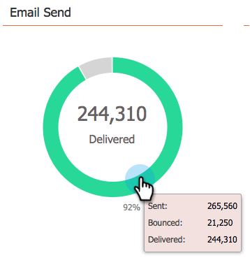
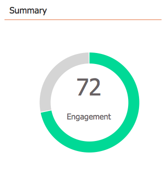
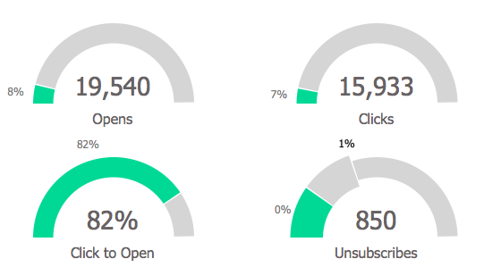
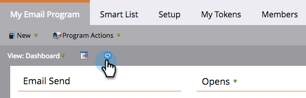

# Använda kontrollpanelen för e-postprogram {#use-the-email-program-dashboard}

Se hur e-postprogrammen fungerar i den här instrumentpanelsvyn.

>[!CAUTION]
>
>Undvik att _återanvända_ ett e-postmeddelande från ett e-postprogram, antingen genom att referera till det i en Smart Campaign eller genom att flytta resursen från det startade e-postprogrammet till ett nytt. Om du gör det sammanställs alla data i varje rapportkontrollpanel som är kopplad till det e-postmeddelandet. Om du behöver återanvända ett e-postmeddelande [klonar du det](/help/marketo/product-docs/core-marketo-concepts/programs/working-with-programs/clone-an-asset-in-a-program.md){target="_blank"} i stället, eftersom det kopierar e-postmeddelandet men skapar ett nytt med ett nytt e-post-ID.

>[!NOTE]
>
>Om ditt program har ett A/B-test går du till [e-postprogramkontrollpanelen - A/B-testvy](/help/marketo/product-docs/email-marketing/email-programs/email-program-actions/email-test-a-b-test/use-the-email-program-dashboard-a-b-test-view.md){target="_blank"}.

>[!NOTE]
>
>Alla data i den här vyn är aggregerade (omfattar A/B-test samt det slutliga e-postmeddelandet).

## Skicka e-post {#email-send}

Här ser du hur många mejl som har skickats, studsat och levererats.

>[!NOTE]
>
>På grund av e-postleveransstandarder som ligger utanför Marketo kontroll är statistiken för Student och Delivers ungefärlig, inte exakt.

## Öppnar/klickar {#opens-clicks}

I det här diagrammet visas antalet e-postmeddelanden som öppnas/klickas under specifika tidsperioder efter att e-postprogrammet har körts.

>[!TIP]
>
>Lägg märke till hur många öppningar/klick som minskar allt eftersom tiden går.

## Sammanfattning - engagemang {#summary-engagement}

Detta visar det övergripande [engagemangspoängen](/help/marketo/product-docs/email-marketing/drip-nurturing/reports-and-notifications/understanding-the-engagement-score.md){target="_blank"}.

## Sammanfattning - resten {#summary-rest}

Resten av informationen visar Öppna, Klickningar, Klick/Öppna förhållande och Avbeställ.

>[!TIP]
>
>Frekvensen **Unsubscribe** i exemplet ovan var så liten att Marketo zoomade in för att ge dig ett bättre utseende. Den andra siffran i fältet läggs bara till för skalning.

>[!NOTE]
>
>**Definition**
>
>**[!UICONTROL Opens]** räknas när e-postmottagaren hämtar e-postbilderna, som innehåller en spårningspixel som infogats av Marketo. Om mottagaren visar e-postmeddelandet men väljer att inte hämta bilderna räknas det inte som en öppen fil. Om bilderna läses in i mottagarens förhandsgranskningsfönster räknas det vanligtvis som en öppen bild, men det varierar beroende på e-postklienten.
>
>**[!UICONTROL Click to Open]** mäter procentandelen e-postmeddelanden som både öppnades och som hade en länk klickad i e-postmeddelandet. Vi tar antalet unika klick dividerat med antalet unika öppningar och multiplicerar med 100 för att visa det som en procentandel.

## Uppdatera instrumentpanel {#refresh-dashboard}

Klicka bara på uppdateringsikonen på instrumentpanelen för att se de senaste data.

>[!MORELIKETHIS]
>
>[Använd kontrollpanelen för e-postprogram - A/B-testvy](/help/marketo/product-docs/email-marketing/email-programs/email-program-actions/email-test-a-b-test/use-the-email-program-dashboard-a-b-test-view.md){target="_blank"}
