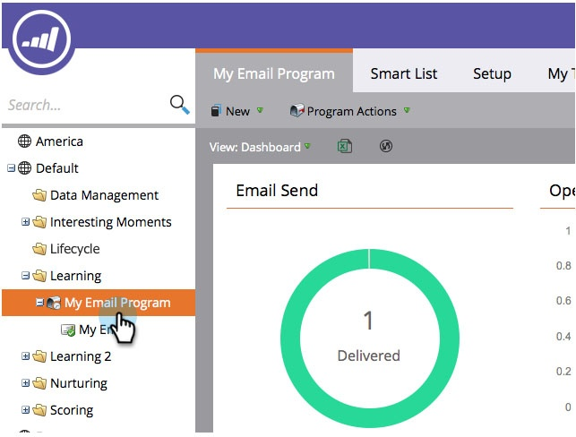
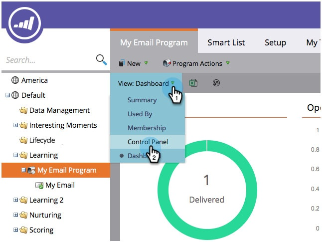

# Visa resultat för e-postprogram {#view-email-program-results}

Precis som på fliken Resultat i smarta kampanjer kan du se samma information i e-postprogram.

1. Gå till **Marknadsföringsaktiviteter**.

   

1. Hitta och välj e-postprogram.

   

   >[!NOTE]
   >
   >Om e-postprogrammet redan har körts dirigeras du direkt till kontrollpanelen för e-postprogrammet.

1. Under **Visa** väljer du **Kontrollpanelen**.

   

1. Klicka på **Visa resultat** under rutan **Målgrupp**.

   

   Där har du den!

   
