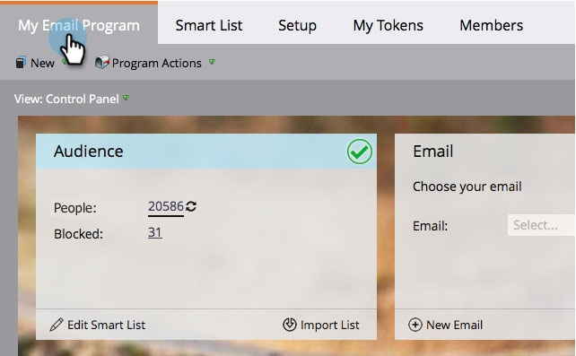

# Definiera en publik med en smart lista {#define-an-audience-with-a-smart-list}

När du har [skapat ett e-postprogram](../../../../product-docs/email-marketing/email-programs/creating-an-email-program/create-an-email-program.md)vill du tala om för det vem du vill skicka e-postmeddelandet till. Du kan göra detta genom att [importera en lista med personer](define-an-audience-by-importing-a-list.md) eller med en smart lista. Så här gör du med en smart lista.

>[!NOTE]
>
>**Förutsättningar**
>
>* [Skapa ett e-postprogram](../../../../product-docs/email-marketing/email-programs/creating-an-email-program/create-an-email-program.md)

>

>[!NOTE]
>
>**Påminnelse**
>
>Det går bara att definiera målgruppen när e-postprogrammet inte har godkänts.

1. Gå till **marknadsföringsaktiviteter**.

   

1. Välj ditt e-postprogram och klicka sedan på **Redigera smart lista** under **målgruppspanelen** .

   

   >[!TIP]
   >
   >Kontrollera att **Kontrollpanelen** är inställd på Visa för att hitta den här inställningen.

1. Hitta de filter du vill använda och dra dem till arbetsytan.

   

1. Definiera filtren.

   

   >[!NOTE]
   >
   >**Djupdykning**
   >
   >
   >Ta en titt på [smarta listor och statiska listor](http://docs.marketo.com/display/docs/smart+lists+and+static+lists) för att lära dig mer om hur du använder och definierar filter.

1. När du är klar med att lägga till och definiera filter går du tillbaka till huvudprogramfliken. Du kommer att se hur många som är kvalificerade.

   

   Utmärkt arbete! Nu är det dags att [välja ett befintligt e-postmeddelande](../../../../product-docs/email-marketing/email-programs/email-program-actions/choose-an-existing-email.md) eller att [skapa ett e-postmeddelande](../../../../product-docs/email-marketing/email-programs/email-program-actions/create-an-email-for-an-email-program.md) att skicka till dessa personer.

>[!NOTE]
>
>**Definition**
>
>Märkte du numret för spärrad? Det här numret är en delmängd av de personer som är kvalificerade och representerar personer som inte kan skicka det här e-postmeddelandet eftersom de är:
>
>* Avbeställ
>* Marknadsföring har pausats
>* Blocklist
>* Ogiltig e-postadress
>* Tom e-postadress

>
>
Klicka på numret om du vill se en detaljerad lista över personer som blockerats från utskick. **Observera:** E-post skickas fortfarande till personer som markerats som avbeställda och marknadsföringen har avbrutits.
>
>Använd knappen  på publikpanelen för att se hur många som får e-postmeddelandet.

>[!NOTE]
>
>**Relaterade artiklar**
>
>* [Välj en befintlig e-postadress](../../../../product-docs/email-marketing/email-programs/email-program-actions/choose-an-existing-email.md)
>* [Skapa ett e-postmeddelande för ett e-postprogram](../../../../product-docs/email-marketing/email-programs/email-program-actions/create-an-email-for-an-email-program.md)

>

