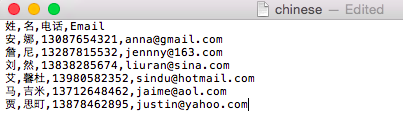

# Importera en icke-latinsk teckenlista {#import-a-non-latin-characters-list}

Försöker du importera en fil som inte är på engelska? Listan ser perfekt ut när du öppnar den med Excel.

Men när du importerar det till Marketo kanske du ser att de icke-engelska tecknen inte plockas upp korrekt.

Det beror på att filen inte har sparats korrekt för Marketo för att alla icke-latinska tecken ska kännas igen. Den goda nyheten är att du kan följa några enkla steg för att åtgärda det.

1. Välj **Spara som..** från menyn **Arkiv** i Excel.

   

1. Välj **UTF-16 Unicode-text (.txt)** som **Format**-alternativ. Detta kodar filen så som Marketo kan visa den.

   

   >[!NOTE]
   >
   >Marketo har också stöd för UTF-8, Shift-JIS eller EUC-JP.

1. Excel sparar den nya filen som en textfil med tillägget .txt. Men det konverterar också alla kommatecken i filen till flikar. Vi måste ändra tillbaka den.

   >[!TIP]
   >
   >Du kan öppna textfilen med **Anteckningar** om du använder Windows eller **TextEdit** om du använder en Mac.

   

1. Välj en flik i dokumentet och kopiera den.

   

1. Välj **Sök och ersätt...** från menyn **Redigera**.

   

   >[!TIP]
   >
   >Motsvarande åtgärd för Windows-användare är: **Redigera > Ersätt..**

1. Klistra in fliken som du kopierade i steg 4 i den första rutan (som ska ersättas) och skriv in ett kommatecken i den andra rutan (ersätt med). Klicka sedan på **Alla**.

   

1. Och voila, alla kommatecken är tillbaka och vi är redo att rulla.

   

1. Importera den nya filen till Marketo så ska informationen visas korrekt den här gången.

   

   >[!NOTE]
   >
   >Alla datum-/tidfält som importeras behandlas som centraltid. Om du har datum-/tidsfält i en annan tidszon kan du använda en Excel-formel för att omvandla den till Central Time (USA/Chicago).

Vi vet att det här är underligt, men det fungerar. Glad import!