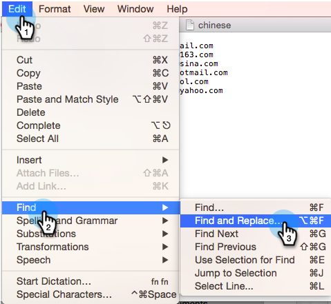

# Importera en icke-latinsk teckenlista {#import-a-non-latin-characters-list}

Försöker du importera en fil som inte är på engelska? Listan ser perfekt ut när du öppnar den med Excel.

Men när du importerar den till Marketo kanske du ser att de tecken som inte är engelska inte plockas upp korrekt.

Detta beror på att filen inte har sparats på rätt sätt så att Marketo kan identifiera alla tecken som inte är latinska. Den goda nyheten är att du kan följa några enkla steg för att åtgärda det.

1. Välj **[!UICONTROL Save As]..** på menyn **[!UICONTROL File]** i Excel.

   

1. Välj **[!UICONTROL UTF-16 Unicode Text (.txt)]** som **[!UICONTROL Format]**-alternativ. Då kodas filen som den visas i Marketo.

   

   >[!NOTE]
   >
   >Marketo har också stöd för UTF-8, Shift-JIS eller EUC-JP.

1. Excel sparar den nya filen som en textfil med tillägget .txt. Men det konverterar också alla kommatecken i filen till flikar. Vi måste ändra tillbaka den.

   >[!TIP]
   >
   >Du kan öppna textfilen med **[!DNL Notepad]** om du använder Windows eller **[!DNL TextEdit]** om du använder en Mac.

   

1. Välj en flik i dokumentet och kopiera den.

   

1. Välj **[!UICONTROL Find and Replace]..** på menyn **[!UICONTROL Edit]**.

   

   >[!TIP]
   >
   >Motsvarande åtgärd för Windows-användare är: **[!UICONTROL Edit]> [!UICONTROL Replace]..**

1. Klistra in fliken som du kopierade i steg 4 i den första rutan (som ska ersättas) och skriv in ett kommatecken i den andra rutan (ersätt med). Klicka sedan på **[!UICONTROL All]**.

   

1. Och voila, alla kommatecken är tillbaka och vi är redo att rulla.

   

1. Importera den nya filen till Marketo så bör informationen visas korrekt den här gången.

   

   >[!NOTE]
   >
   >Alla datum-/tidfält som importeras behandlas som centraltid. Om du har datum-/tidsfält i en annan tidszon kan du använda en Excel-formel för att omvandla den till Central Time (USA/Chicago).

Vi vet att det här är underligt, men det fungerar. Glad import!
