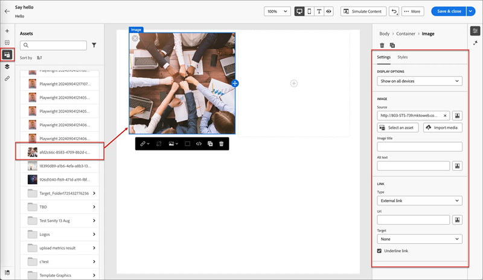

# Framtagning av e-post {#email-authoring}

Lär dig hur du skapar, anpassar och förhandsgranskar e-postmeddelanden i nya Marketo Engage Email Designer.

>[!IMPORTANT]
>
>Den här artikeln är endast avsedd för medlemmar av nya Marketo Engage Email Designer beta. Sprid inte information.

## Skapa ett e-postmeddelande {#create-an-email}

1. Logga in på Marketo Engage via [Adobe Experience Cloud](https://experiencecloud.adobe.com/){target="_blank"}.

1. I Min Marketo väljer du **Design Studio**.

   

1. Välj **E-post (ny redigerare)** i trädet.

   

1. Klicka på knappen **Skapa e-post** .

   

1. Ange ett e-postnamn och en ämnesrad. Klicka på **Skapa**.

   

Så där ja. Nu är det dags att designa e-postmeddelanden.

## Välj innehållstyp {#choose-your-content-type}

1. Klicka på **Lägg till e-postinnehåll** i det e-postmeddelande du just skapade.

   

1. Sidan _Skapa din e-post_ läses in. Du kan välja mellan några alternativ:

* [Designa från grunden](#design-from-scratch) med den visuella e-postredigeraren

* [Importera din egen HTML](#import-html) via en HTML- eller zip-fil

* [Välj en befintlig mall](#choose-a-template) (ett av våra exempel eller ett du redan har sparat)

### Designa från grunden {#design-from-scratch}

När du börjar från början i e-postredigeraren använder du alternativen nedan för att definiera ditt innehåll.

1. Välj **Designa från grunden** på sidan _Skapa ditt e-postmeddelande_.

1. Lägg till [struktur och innehåll](#add-structure-and-content) i e-postmeddelandet.

1. Lägg till [bilder](#add-assets).

1. [Anpassa](#personalize-content) innehållet.

1. Granska länkar och [redigera spårning](#edit-url-tracking).

### Importera HTML {#import-html}

Du kan importera befintligt HTML-innehåll för att utforma e-postmeddelandet. Innehållet kan vara

* En HTML-fil med en infogad formatmall

* En ZIP-fil som innehåller en HTML-fil, formatmallen (.css) och bilder

>[!NOTE]
>
>ZIP-filstrukturen har inga begränsningar. Referenserna måste dock vara relativa och passa in i trädstrukturen i ZIP-mappen.

1. Välj **Importera HTML** på mallsidan.

1. Dra och släpp HTML- eller ZIP-filen (eller välj en fil på datorn) och klicka på **Importera**.

   

>[!NOTE]
>
>När HTML-innehållet har överförts är ditt innehåll i kompatibilitetsläge. I det här läget kan du bara anpassa texten, lägga till länkar eller lägga till resurser i innehållet.

Du kan göra önskade ändringar av det importerade innehållet med de [visuella redigeringsverktygen för e-post](#add-structure-and-content).

### Välj en mall {#choose-a-template}

Det finns två typer av mallar att välja mellan.

* **Exempelmallar**: Marketo Engage har fyra färdiga e-postmallar.

* **Sparade mallar**: Det här är mallar som du har skapat från grunden via menyn Mallar eller ett e-postmeddelande som du har skapat och valt att spara som en mall.

>[!BEGINTABS]

>[!TAB Exempelmallar]

Välj en av de färdiga mallarna för att snabbt komma igång med designen av e-postmallar.

1. Fliken Exempelmallar är öppen som standard.

1. Markera den mall som du vill använda.

   

1. Klicka på **Använd mallen**.

   

1. Redigera innehållet efter behov med hjälp av designern för visuellt innehåll.

>[!TAB Sparade mallar]

1. Klicka på fliken **Sparade mallar** och välj önskad mall.

   

1. Klicka på **Använd mallen**.

   

1. Redigera innehållet efter behov med hjälp av designern för visuellt innehåll.

>[!ENDTABS]

## Lägga till struktur och innehåll {#add-structure-and-content}

1. Om du vill börja skapa eller ändra innehåll drar och släpper du ett objekt från Strukturer på arbetsytan. Redigera inställningarna i rutan till höger.

   >[!TIP]
   >
   >Markera n:n-kolumnkomponenten för att definiera hur många kolumner du vill ha (mellan tre och 10). Du kan också definiera bredden på varje kolumn genom att flytta pilarna under kolumnen.

   

   >[!NOTE]
   >
   >Varje kolumnstorlek får inte vara mindre än 10 % av strukturkomponentens totala bredd. Endast tomma kolumner kan tas bort.

1. I avsnittet Innehåll drar du över önskade objekt och släpper dem i en eller flera strukturkomponenter.

   

1. Varje komponent kan anpassas via flikarna Inställningar eller Format. Ändra teckensnitt, textstil, marginal med mera.

### Lägg till Assets {#add-assets}

Lägg till bilder som lagras i avsnittet [Bilder och filer](/help/marketo/product-docs/demand-generation/images-and-files/add-images-and-files-to-marketo.md){target="_blank"} i din Marketo Engage-instans.

>[!NOTE]
>
>Du kan bara lägga till bilder i den nya designern, inga andra filtyper för närvarande.

1. Om du vill komma åt dina bilder klickar du på ikonen Resursväljare.

   

1. Dra och släpp den önskade bilden i en strukturkomponent.

   

   >[!NOTE]
   >
   >Om du vill ersätta en befintlig bild markerar du den och klickar sedan på **Välj en resurs** på fliken Inställningar till höger.

### Lager, inställningar och format {#layers-settings-styles}

Öppna navigeringsträdet för att komma åt specifika strukturer och deras kolumner/komponenter för mer detaljerad redigering. Klicka på ikonen Navigeringsträd om du vill komma åt filen.

I exemplet nedan beskrivs stegen för att justera utfyllnad och lodrät justering inuti en strukturelement som består av kolumner.

1. Markera kolumnen i strukturkomponenten direkt på arbetsytan eller med _navigeringsträdet_ som visas till vänster.

1. Klicka på verktyget _[!UICONTROL Select a column]_i kolumnverktygsfältet och välj det som du vill redigera.

   Du kan också välja det i strukturträdet. De redigerbara parametrarna för den kolumnen visas på flikarna _[!UICONTROL Settings]_och_[!UICONTROL Styles]_ till höger.

   

1. Om du vill redigera kolumnegenskaperna klickar du på fliken _[!UICONTROL Styles]_till höger och ändrar dem efter dina behov:

   * Ändra bakgrundsfärgen för **[!UICONTROL Background]** efter behov.

     Avmarkera kryssrutan för en genomskinlig bakgrund. Aktivera inställningen **[!UICONTROL Background image]** om du vill använda en bild som bakgrund i stället för en heltäckande färg.

   * För **[!UICONTROL Alignment]** väljer du ikonen _Överkant_, _Mitten_ eller _Nederkant_ .
   * För **[!UICONTROL Padding]** definierar du utfyllnaden för alla sidor.

     Välj **[!UICONTROL Different padding for each side]** om du vill justera utfyllnaden. Klicka på ikonen _Lås_ om du vill avbryta synkroniseringen.

   * Expandera avsnittet **[!UICONTROL Advanced]** för att definiera infogade format för kolumnen.

   

1. Upprepa de här stegen efter behov för att justera justeringen och utfyllnaden för de andra kolumnerna i komponenten.

1. Spara ändringarna.

### Anpassa innehåll {#personalize-content}

Tokens fungerar på samma sätt i den nya redigeraren som i den gamla, men ikonen ser annorlunda ut. Exemplet nedan visar hur du lägger till en token för förnamn med reservtext.

1. Markera textkomponenten. Placera markören där du vill att token ska visas och klicka på ikonen **Lägg till anpassning** .

   

1. Klicka på önskad [tokentyp](/help/marketo/product-docs/demand-generation/landing-pages/personalizing-landing-pages/tokens-overview.md){target="_blank"}.

   

1. Hitta önskad token och klicka på ikonen **..** (klicka på ikonen + i stället för att lägga till en token utan reservtext).

   

   >[!NOTE]
   >
   >&quot;Reservtext&quot; är den nya redigerartermen för standardvärde. Exempel: ``{{lead.First Name:default=Friend}}``. Det rekommenderas om det inte finns något värde för personen i det fält du väljer.

1. Ange din reservtext och klicka på **Lägg till**.

   

1. Klicka på **Spara**.

### Redigera URL-spårning {#edit-url-tracking}

Ibland vill du inte aktivera URL:en för Marketo-spårning för en länk i ett e-postmeddelande. Detta är användbart när målsidan inte stöder URL-parametrar och kan resultera i en bruten länk.

1. Klicka på ikonen Länkar för att visa alla URL:er i e-postmeddelandet.

   

1. Klicka på pennikonen om du vill redigera spårning för länkarna.

1. Klicka på listrutan **Spårningstyp** och gör ditt val.

   

   <table><tbody>
     <tr>
       <td><b>Spåra utan mkt_tok</b></td>
       <td>Aktiverar spårning på URL:en utan att parametern för frågesträngen mkt_tok används i mål-URL:en</td>
     </tr>
     <tr>
       <td><b>Spåra med mkt_tok</b></td>
       <td>Aktiverar spårning på URL:en med hjälp av frågesträngparametern mkt_tok i mål-URL:en</td>
     </tr>
     <tr>
       <td><b>Spåra inte</b></td>
       <td>Inaktiverar spårning av URL:en</td>
     </tr>
   </tbody>
   </table>

1. Du kan också ge URL:en en etikett eller lägga till taggar.

1. Klicka på **Spara** när du är klar.

## Kontrollera aviseringar {#check-alerts}

När du utformar ditt innehåll visas varningar i skärmens övre högra hörn när nyckelinställningar saknas.

Det finns två typer av varningar:

**Varningar**

Varningar hänvisar till rekommendationer och bästa praxis, som:

* **Avanmälningslänken finns inte i e-postmeddelandet**: Även om det är ett krav att avbryta prenumerationen är det bäst att lägga till dem i e-postmeddelandet.

>[!NOTE]
>
>Du behöver inte lägga till ett alternativ för att avbryta prenumerationen för [operativa e-postmeddelanden](/help/marketo/product-docs/email-marketing/general/functions-in-the-editor/make-an-email-operational.md) (ej marknadsföring).

* **Textversionen av HTML är tom**: Du måste definiera en textversion av e-postbrödtexten för när HTML-innehåll inte kan visas.

* **En tom länk finns i e-postbrödtexten**: Kontrollera att alla länkar i e-postmeddelandet är korrekta.

* **E-poststorleken har överskridit gränsen på 100 kB**: Kontrollera att e-postens storlek inte överskrider 100 kB för optimal leverans.

**Fel**

Fel förhindrar att du skickar eller testar e-postmeddelandet tills de har lösts:

* **Ämnesraden saknas**: En ämnesrad för e-post krävs.

* **E-postversionen av meddelandet är tom**: Det här felet inträffar när e-postinnehållet inte har konfigurerats.

## Testa din e-post {#test-your-email}

När meddelandeinnehållet har definierats kan du använda testprofiler för att förhandsgranska det, skicka korrektur och styra hur det återges i vanliga dator-, mobil- och webbaserade klienter. Om du har infogat anpassat innehåll kan du kontrollera hur det visas i meddelandet med hjälp av testprofilsdata.

Om du vill förhandsgranska ditt e-postinnehåll klickar du på **Simulera innehåll** och lägger sedan till en testprofil för att kontrollera meddelandet med testprofildata.

## Referera till ett e-postmeddelande {#reference-an-email}

När du har skapat ett e-postmeddelande i den nya redigeraren kan du referera till det i Smarta kampanjer och/eller Smarta listor på samma sätt som du gör med andra e-postmeddelanden.

* Referera den i en smart lista genom att [följa de vanliga stegen](/help/marketo/product-docs/core-marketo-concepts/smart-lists-and-static-lists/creating-a-smart-list/create-a-smart-list.md).

* Referera det i en smart kampanj genom att [följa de vanliga stegen](/help/marketo/product-docs/core-marketo-concepts/smart-campaigns/creating-a-smart-campaign/create-a-new-smart-campaign.md).

>[!NOTE]
>
>Det går bara att referera till sparade e-postmeddelanden. Den nya e-postdesignern har ingen&quot;godkänd&quot; status.

>[!MORELIKETHIS]
>
>[E-postmallar](/help/marketo/product-docs/email-marketing/general/beta-new-email-designer/email-templates.md){target="_blank"}: Lär dig hur du skapar, utformar och får tillgång till en e-postmall i den nya designern.
