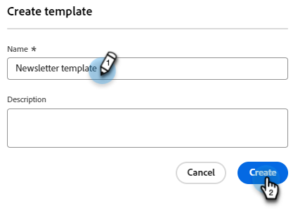

# E-postmallar {#email-templates}

För en snabbare och förbättrad designprocess kan du skapa fristående e-postmallar för att enkelt återanvända anpassat innehåll.

>[!IMPORTANT]
>
>Den här artikeln är endast avsedd för medlemmar av den nya betaversionen av Marketo Engage Email Designer. Sprid inte information.

>[!PREREQUISITES]
>
>Din Marketo Engage-prenumeration måste migreras till [Adobe Identity Management System (IMS)](https://experienceleague.adobe.com/en/docs/marketo/using/product-docs/administration/marketo-with-adobe-identity/adobe-identity-management-overview) för att du ska kunna komma åt den nya e-postdesignern. Om du inte har gjort det än och vill begära att det ska gå fort kontaktar du Adobe Account Team (din kontoansvarige) eller [Marketo Support](https://nation.marketo.com/t5/support/ct-p/Support).

>[!NOTE]
>
>E-postmallar i den nya e-postdesignern kan bara användas för att skapa e-postmeddelanden i den nya e-postdesignern. Det går inte att referera till dem i den gamla e-postredigeraren.

## Skapa en e-postmall {#create-an-email-template}

1. Logga in på Marketo Engage via [Adobe Experience Cloud](https://experiencecloud.adobe.com/){target="_blank"}.

1. I Min Marketo väljer du **Design Studio**.

   

1. Välj **E-postmallar (ny redigerare)** i trädet.

   

1. Klicka på knappen **Skapa mall**.

   

1. Ange ett mallnamn och en valfri beskrivning. Klicka på **Skapa**.

   

## Utforma en mall {#design-your-template}

På sidan _Designa mallen_ kan du välja bland ett par alternativ. [Designa från grunden](#design-from-scratch), [importera din egen HTML](#import-html) eller [välj en befintlig mall](#choose-a-template) (ett av våra exempel eller ett du redan har sparat).

### Designa från grunden {#design-from-scratch}

Definiera innehållet genom att lägga till och flytta strukturella element med enkla dra och släpp-åtgärder.

1. På sidan _Designa mallen_ väljer du **Designa från grunden**.

1. Lägg till [struktur och innehåll](#add-structure-and-content).

### Importera din HTML {#import-your-html}

Du kan importera befintligt HTML-innehåll för att utforma e-postmallar. Innehållet kan vara

* En HTML-fil med en inbyggd formatmall

* En ZIP-fil som innehåller en HTML-fil, formatmallen (.css) och bilder

>[!NOTE]
>
>ZIP-filstrukturen har inga begränsningar. Referenserna måste dock vara relativa och passa in i trädstrukturen i ZIP-mappen.

1. Välj _Importera HTML_ på sidan **Designa din mall**.

1. Dra och släpp önskad HTML- eller ZIP-fil (eller välj en fil på datorn) och klicka på **Importera**.

   

   >[!NOTE]
   >
   >När HTML-innehållet har överförts är ditt innehåll i kompatibilitetsläge. I det här läget kan du bara anpassa texten, lägga till länkar eller lägga till resurser i innehållet.

1. Om du vill använda Designer-innehållskomponenterna för e-post klickar du på fliken **HTML-konverterare** och sedan på **Konvertera**.

   >[!CAUTION]
   >
   >Om du använder en `<table>`-tagg som det första lagret i en HTML-fil kan du förlora format, inklusive inställningar för bakgrund och bredd i den översta lagertaggen.

Du kan nu anpassa den importerade filen efter behov med den visuella e-postredigeraren.

### Välj en mall {#choose-a-template}

Det finns två typer av mallar att välja mellan.

* **Exempelmallar**: Marketo Engage har fyra färdiga e-postmallar.

* **Sparade mallar**: Det här är mallar som du har skapat från grunden via menyn Mallar eller ett e-postmeddelande som du har skapat och valt att spara som en mall.

>[!BEGINTABS]

>[!TAB Exempelmallar]

Välj en av de färdiga mallarna för att snabbt komma igång med designen av e-postmallar.

1. Fliken Exempelmallar är öppen som standard.

1. Markera den mall som du vill använda.

   

1. Klicka på **Använd mallen**.

   

1. Redigera innehållet efter behov med hjälp av designern för visuellt innehåll.

>[!TAB Sparade mallar]

1. Klicka på fliken **Sparade mallar** och välj önskad mall.

   

1. Klicka på **Använd mallen**.

   

1. Redigera innehållet efter behov med hjälp av designern för visuellt innehåll.

>[!ENDTABS]

## Lägga till struktur och innehåll {#add-structure-and-content}

1. Om du vill börja skapa eller ändra innehåll drar och släpper du ett objekt från Strukturer på arbetsytan. Redigera inställningarna i rutan till höger.

   >[!TIP]
   >
   >Välj kolumnkomponenten n:n för att definiera antalet kolumner du vill använda (mellan tre och 10). Du kan också definiera bredden på varje kolumn genom att flytta pilarna under kolumnen.

   

   >[!NOTE]
   >
   >Varje kolumnstorlek får inte vara mindre än 10 % av strukturkomponentens totala bredd. Endast tomma kolumner kan tas bort.

1. I avsnittet Innehåll drar du över önskade objekt och släpper dem i en eller flera strukturkomponenter.

   

1. Varje komponent kan anpassas via flikarna Inställningar eller Format. Ändra teckensnitt, textstil, marginal med mera.

### Lägg till Assets {#add-assets}

Lägg till bilder som lagras i avsnittet [Bilder och filer](/help/marketo/product-docs/demand-generation/images-and-files/add-images-and-files-to-marketo.md){target="_blank"} i din Marketo Engage-instans.

>[!NOTE]
>
>Du kan bara lägga till bilder i den nya designern, inga andra filtyper för närvarande.

1. Om du vill komma åt dina bilder klickar du på ikonen Resursväljare.

   

1. Dra och släpp den önskade bilden i en strukturkomponent.

   

   >[!NOTE]
   >
   >Om du vill ersätta en befintlig bild markerar du den och klickar sedan på **Välj en resurs** på fliken Inställningar till höger.

### Lager, inställningar och format {#layers-settings-styles}

Öppna navigeringsträdet för att komma åt specifika strukturer och deras kolumner/komponenter för mer detaljerad redigering. Klicka på ikonen Navigeringsträd om du vill komma åt filen.

I exemplet nedan beskrivs stegen för att justera utfyllnad och lodrät justering inuti en strukturelement som består av kolumner.

1. Markera kolumnen i strukturkomponenten direkt på arbetsytan eller med _navigeringsträdet_ som visas till vänster.

1. Klicka på verktyget _[!UICONTROL Select a column]_&#x200B;i kolumnverktygsfältet och välj det som du vill redigera.

   Du kan också välja det i strukturträdet. De redigerbara parametrarna för den kolumnen visas på flikarna _[!UICONTROL Settings]_&#x200B;och&#x200B;_[!UICONTROL Styles]_ till höger.

   

1. Om du vill redigera kolumnegenskaperna klickar du på fliken _[!UICONTROL Styles]_&#x200B;till höger och ändrar dem efter dina behov:

   * Ändra bakgrundsfärgen för **[!UICONTROL Background]** efter behov.

     Avmarkera kryssrutan för en genomskinlig bakgrund. Aktivera inställningen **[!UICONTROL Background image]** om du vill använda en bild som bakgrund i stället för en heltäckande färg.

   * För **[!UICONTROL Alignment]** väljer du ikonen _Överkant_, _Mitten_ eller _Nederkant_ .
   * För **[!UICONTROL Padding]** definierar du utfyllnaden för alla sidor.

     Välj **[!UICONTROL Different padding for each side]** om du vill justera utfyllnaden. Klicka på ikonen _Lås_ om du vill avbryta synkroniseringen.

   * Expandera avsnittet **[!UICONTROL Advanced]** för att definiera infogade format för kolumnen.

   

1. Upprepa de här stegen efter behov för att justera justeringen och utfyllnaden för de andra kolumnerna i komponenten.

1. Spara ändringarna.

### Anpassa innehåll {#personalize-content}

Tokens fungerar på samma sätt i den nya redigeraren som i den gamla, men ikonen ser annorlunda ut. Exemplet nedan visar hur du lägger till en token för förnamn med reservtext.

1. Markera textkomponenten. Placera markören där du vill att token ska visas och klicka på ikonen **Lägg till anpassning** .

   

1. Klicka på önskad [tokentyp](/help/marketo/product-docs/demand-generation/landing-pages/personalizing-landing-pages/tokens-overview.md){target="_blank"}.

   

1. Hitta önskad token och klicka på ikonen **..** (klicka på ikonen + i stället för att lägga till en token utan reservtext).

   

   >[!NOTE]
   >
   >&quot;Reservtext&quot; är den nya redigerartermen för standardvärde. Exempel: ``{{lead.First Name:default=Friend}}``. Det rekommenderas om det inte finns något värde för personen i det fält du väljer.

1. Ange din reservtext och klicka på **Lägg till**.

   

1. Klicka på **Spara**.

### Redigera URL-spårning {#edit-url-tracking}

Ibland vill du inte aktivera URL:en för Marketo-spårning för en länk i ett e-postmeddelande. Detta är användbart när målsidan inte stöder URL-parametrar och kan resultera i en bruten länk.

1. Klicka på ikonen Länkar för att visa alla URL:er i e-postmeddelandet.

   

1. Klicka på pennikonen om du vill redigera spårning för länkarna.

1. Klicka på listrutan **Spårningstyp** och gör ditt val.

   

   <table><tbody>
     <tr>
       <td><b>Spåra utan mkt_tok</b></td>
       <td>Aktiverar spårning på URL:en utan att parametern för frågesträngen mkt_tok används i mål-URL:en</td>
     </tr>
     <tr>
       <td><b>Spåra med mkt_tok</b></td>
       <td>Aktiverar spårning på URL:en med hjälp av frågesträngparametern mkt_tok i mål-URL:en</td>
     </tr>
     <tr>
       <td><b>Spåra inte</b></td>
       <td>Inaktiverar spårning av URL:en</td>
     </tr>
   </tbody>
   </table>

1. Du kan också ge URL:en en etikett eller lägga till taggar.

1. Klicka på **Spara** när du är klar.

### Visningsalternativ {#view-options}

Utnyttja de alternativ för visning och innehållsvalidering som finns i den visuella e-postredigeraren.

* Zooma in/ut i innehållet med förinställda zoomalternativ.

* Visa innehållet på datorer, mobiler eller i textformat/oformaterad text.

   * Klicka på ikonen för live-vyn (ögat) om du vill förhandsgranska innehåll på olika enheter.

   * Välj en av de färdiga enheterna eller ange anpassade dimensioner för att förhandsgranska innehållet.

### Fler alternativ {#more-options}

Från alternativen för **Mer** i innehållsredigeraren kan du utföra följande åtgärder:

* **Återställ mall**: Välj det här alternativet om du vill rensa den visuella e-postdesignerns arbetsyta till en tom plats och starta om skapandet av innehåll.

* **Ändra din design**: Återgå till sidan _Designa din mall_. Härifrån kan du utföra vilken åtgärd som helst som beskrivs i avsnittet [Utforma din mall](#design-your-template).

* **Exportera HTML**: Hämta innehåll på den visuella arbetsytan till ditt lokala system i HTML-format som paketerats som en zip-fil.

## Visa mallinformation {#view-template-details}

Klicka på namnet på en e-postmall på listsidan _E-postmallar_ för att visa informationen om mallen.

(assets/view-template-details-1.png)

Grundläggande information som namn och beskrivning kan redigeras. Klicka utanför fältet som du redigerade för att spara ändringarna.

Klicka på **Mer** om du snabbt vill ta bort eller duplicera mallen.

Om det finns aktiva varningar (fel/varningar för e-postmallen) klickar du på Varningar för att visa informationen.

>[!NOTE]
>
>Dessa aviseringar förhindrar inte att e-postmallen används för att skapa e-postmeddelanden, men informationen ger synlighet om vad som kanske inte fungerar och vilka uppdateringar som krävs innan e-postmeddelandet kan användas för leverans.

## Visa e-postmall som används av referenser {#email-template-used-by-references}

Klicka på fliken **Används av** i e-postmallssammanfattningen för att visa information om var den här e-postmallen har använts i Marketo Engage.

## Redigera e-postmallar {#edit-email-templates}

Den här åtgärden kan utföras från:

* Fliken Information - Klicka på **Redigera e-postmall**.

Den här åtgärden tar dig till sidan _Designa din mall_ eller den visuella innehållets redigeringssida baserat på den senast sparade statusen för e-postmallen. Härifrån kan du redigera e-postmallens innehåll efter behov. Mer information om redigeringsalternativen finns i Skapa e-postmallar.

## Duplicera e-postmallar {#duplicate-email-templates}

Det finns två sätt att duplicera en e-postmall:

* Klicka på **Mer** och välj **Duplicera** i informationen om e-postmallen till höger.

  

* Klicka på ikonen Fler åtgärder (tre punkter) för den önskade e-postmallen på listsidan _E-postmallar_ och välj **Duplicera**.

Ange ett unikt namn och en valfri beskrivning i dialogrutan. Klicka på **Duplicera** när du är klar.

Den duplicerade e-postmallen visas sedan på listsidan _E-postmallar_ .

## Ta bort e-postmallar {#delete-email-templates}

Det finns två sätt att ta bort en e-postmall.

>[!CAUTION]
>
>Det går inte att ångra borttagning av en e-postmall.

* Klicka på **Mer** och välj **Ta bort** i informationen om e-postmallen till höger.

  

* Klicka på ikonen Fler åtgärder (tre punkter) för den önskade e-postmallen på listsidan _E-postmallar_ och välj **Ta bort**.

## Massåtgärder {#bulk-actions}

På listsidan _E-postmallar_ väljer du flera mallar genom att markera kryssrutorna till vänster. En banderoll visas längst ned.

**Ta bort**: Du kan ta bort högst 20 mallar samtidigt. I en bekräftelsedialogruta kan du avbryta åtgärden eller bekräfta borttagningen.

>[!MORELIKETHIS]
>
>[Skapa e-post](/help/marketo/product-docs/email-marketing/general/beta-new-email-designer/email-authoring.md){target="_blank"}: Lär dig hur du skapar, utformar och refererar till ett e-postmeddelande i den nya designern.
