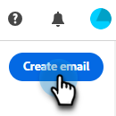

# Skapa ett e-postmeddelande {#create-an-email}

Introduktionstext här.

1. Logga in på [Adobe Experience Cloud](https://experiencecloud.adobe.com/).

   SCREENSHOT??

LISTA VARJE STEG TILLS DU GET TILL MARKETO??

1. I Min Marketo väljer du **Design Studio**.

   

1. Välj **E-post (ny redigerare)** i trädet.

   

1. Klicka på knappen **Skapa e-post** .

   

1. Ange ett e-postnamn och en ämnesrad. Klicka på **Skapa**.

   

Ditt e-postmeddelande skapas. Nu är det dags att designa det. LÄNK
