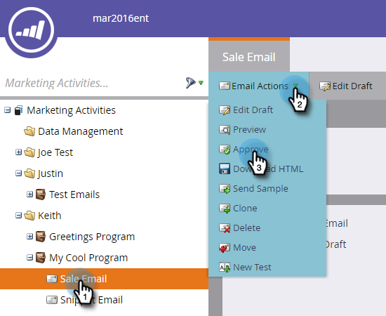

# Godkänn ett e-postmeddelande {#approve-an-email}

E-postmeddelanden börjar i utkastläge. De är vanligtvis inte tillgängliga i systemet förrän du har godkänt dem. Det finns flera sätt att godkänna ett e-postmeddelande.

## Godkänn det med hjälp av menyn E-poståtgärder {#approve-it-using-the-email-actions-menu}

1. Sök efter och välj e-post, klicka på listrutan **E-poståtgärder** och välj **Godkänn**.

   `   
`

## Godkänn det direkt i trädet {#approve-it-directly-in-the-tree}

1. Hitta och välj e-postadress, högerklicka på den och välj **Godkänn**.

   

## Godkänn din e-post i e-postredigeraren {#approve-your-email-in-the-email-editor}

1. Klicka på listrutan **E-poståtgärder** i e-postmeddelandet och välj **Godkänn och stäng**.

   

När e-postmeddelandet har godkänts är det klart att användas!
