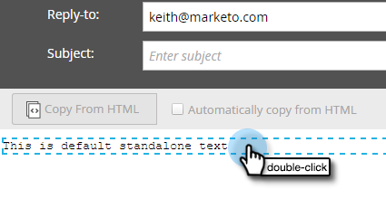

# Skapa ett e-postmeddelande med endast text {#create-a-text-only-email}

Om du någonsin vill skicka e-post med enbart text är det så här du skapar ett e-postmeddelande som kan skickas utan HTML-innehåll.

>[!NOTE]
>
>Eftersom öppningar spåras av mottagaren som hämtar e-postbilderna (som innehåller en osynlig spårningspixel), kan öppningarna **inte** spåras för e-postmeddelanden med enbart text.

1. Gå till **Marknadsföringsaktiviteter**.

   

1. Välj program, klicka på listrutan **Nytt** och välj **Ny lokal resurs**.

   

1. Välj **E-post**.

   

1. Ange ett **namn**, markera en mall och klicka på **Skapa**.

   

1. Klicka på **E-postinställningar** i e-postredigeraren.

   

1. Markera **Endast text** och klicka på **Spara**.

   

   >[!CAUTION]
   >
   >Länkar spåras inte automatiskt i e-postmeddelanden som bara innehåller text. Se hur du [lägger till spårade länkar i ett e-postmeddelande](../../../../product-docs/email-marketing/general/functions-in-the-editor/add-tracked-links-to-a-text-email.md).

   >[!TIP]
   >
   >Du kan även redigera ett befintligt e-postmeddelande och ändra den här inställningen. Glöm inte att godkänna utkastet.

1. Avmarkera kryssrutan **Kopiera automatiskt från HTML**.

   

   >[!NOTE]
   >
   >Allt innehåll som läggs till i HTML-avsnittet i e-postmeddelandet ignoreras när det skickas.

1. Dubbelklicka på textområdet.

   

1. Redigera texten och klicka på **Spara**.

   

Det är så enkelt.
