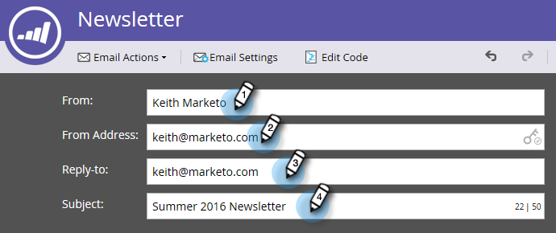

# Redigera din e-postrubrik {#edit-your-email-header}

E-postrubriken i Marketo är helt anpassningsbar. Det består av fyra fält:

* **Från** - Avsändarens namn som du vill att det ska visas
* **Från adress** - Avsändarens e-postadress som du vill att den ska visas
* **Svar till** - Den e-postadress som du vill att en persons svar ska skickas till (kan vara en annan än Från adress)
* **Ämne** - E-postens ämnesrad

Om du vill redigera dessa värden klickar du i varje fält och anger din information.

>[!TIP]
>
>Om du vill ange ett standardvärde för Från namn och Från e-post läser du [Ändra standardvärdet från e-post och Från etikett](/help/marketo/product-docs/administration/email-setup/change-the-default-from-email-and-from-label.md).

Om du vill använda en variabel klickar du i det önskade fältet först och sedan på variabelikonen.

Du kan också göra fältet dynamiskt genom att använda segment.

Nyckelikonen längst till höger i fältet Från adress anger om du använder en anpassad DKIM-signatur.

Räknaren längst till höger i fältet Ämne hjälper dig att hålla ämnesraden under den rekommenderade gränsen på 50 tecken.

Om du anger fler än 50 tecken visas räknaren i rött så att du får en varning.

>[!MORELIKETHIS]
>
>* [E-postredigerare v2.0 - översikt](/help/marketo/product-docs/email-marketing/general/email-editor-2/email-editor-v2-0-overview.md)

