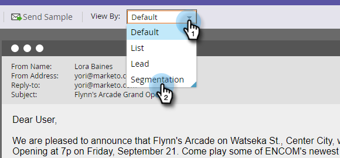

# Skicka ett exempelmeddelande {#send-a-sample-email}

Det går snabbt och enkelt att skicka exempel på e-postmeddelanden. Mer information om hur du skickar e-post med dynamiskt innehåll finns i [Förhandsgranska ett e-postmeddelande med dynamiskt innehåll](/help/marketo/product-docs/email-marketing/general/functions-in-the-editor/preview-an-email-with-dynamic-content.md).

>[!NOTE]
>
>Du måste ha behörigheten **Access Database - Run Single Flow Actions** för att kunna skicka exempelmeddelanden.

## Skicka ett exempelmeddelande {#send-a-sample-email-1}

1. Hitta och välj din e-postadress. Klicka på listrutan **E-poståtgärder** och välj **Skicka exempel**.\
   

   >[!NOTE]
   >
   >Mina token matchar värdet som passar e-postprogrammet.

1. Ange en e-postadress för leveransen och klicka på **Skicka**.

   

   >[!NOTE]
   >
   >Om du vill ange flera e-postadresser avgränsar du dem med kommatecken.

   >[!TIP]
   >
   >Om du vill lösa tokens som en viss person väljer du personen i listrutan **person** i steg 2.

## Skicka ett exempelmeddelande när du redigerar {#send-a-sample-email-while-editing}

1. Leta reda på e-postmeddelandet, markera det och klicka på fliken **Redigera utkast**.

   

1. Klicka på **E-poståtgärder** och välj **Skicka exempel**.

   

1. Ange en e-postadress för leveransen och klicka på **Skicka**.

   

   >[!NOTE]
   >
   >Utlösarfältet gäller endast för dem som använder [e-postskript](https://developers.marketo.com/documentation/velocity-script/).

## Skicka ett exempel på e-post baserat på ett segment {#send-a-sample-email-based-on-a-segment}

>[!PREREQUISITES]
>
>[Använd segmentering i e-postmeddelanden](/help/marketo/product-docs/email-marketing/general/functions-in-the-editor/using-dynamic-content-in-an-email.md).

1. Leta reda på e-postmeddelandet, markera det och klicka på fliken **Redigera utkast**.

   

1. Klicka på **Förhandsgranska**.

   

1. Klicka på listrutan **Visa efter** och välj **Segmentering**.

   

1. En listruta med tillgängliga segmenteringar visas. Klicka på den och välj en.

   

1. Använd pilarna för att bläddra igenom alternativen (i det här fallet har ämnesraden dynamiskt ändrats).

   

1. Klicka på **Skicka exempel** om du vill få ett test-e-postmeddelande om ditt segment i aktion.

   

   >[!TIP]
   >
   >Du kan också skicka ett exempelmejl baserat på ett segment i redigeringsläget för e-postmeddelandet. Klicka på listrutan **E-poståtgärder**, välj **Skicka exempel** och välj sedan ditt segment.

Det är mycket viktigt att ta prov på ditt innehåll innan en kampanj lanseras. Mät två gånger, en gång!
