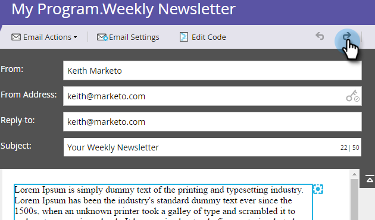

# Ångra i e-postredigeraren {#undo-in-the-email-editor}

1. Om du vill ångra en ändring klickar du på vänsterpilen.

>[!TIP]
>
>Ångra kan gå tillbaka upp till 50 ändringar.

1. Om du vill göra om en ändring klickar du på högerpilen.

   

   >[!NOTE]
   >
   >Du kan inte ångra medan du redigerar text. När du är klar kan du ångra alla ändringar från den första redigeringen till sparandet.

   Snyggt! Nu kan du ångra och göra om som ett proffs.
