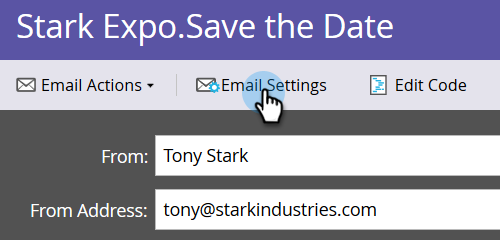

# Email CC {#email-cc}

Med Email CC kan angivna e-postmeddelanden skickas via Marketo till att inkludera CC-mottagare.

Den här funktionen är tillgänglig för alla Marketo-e-postresurser, oavsett hur e-postmeddelandet skickas (batch- eller utlösarkampanj). CC-mottagaren får en exakt kopia av e-postmeddelandet som skickas till den valda Marketo-personen. Därför kan alla aktiviteter (öppningar, klickningar osv.) loggas i aktivitetsloggen för Marketo Person på raden &quot;Till&quot; i e-postmeddelandet. Leveransaktivitet (skickad, levererad, hård studsning osv.) *annat än &quot;soft bounce&quot;* registreras  **** inte eftersom Marketo inte kan skilja leveranshändelser för Marketo-personen från CC-mottagarna. Marketo kommer endast att CC för upp till 100 000 personer i taget. Om din smarta lista överstiger 100 kB och det är absolut nödvändigt att alla personer på den får CC rekommenderar vi att du delar upp din lista.

>[!NOTE]
>
>Email CC var inte utformat för att användas med A/B-tester. Du kan använda det i alla fall om du vill, men eftersom det tekniskt inte stöds, skulle Marketo Support inte kunna hjälpa till med felsökningen.

## Konfigurera Email CC {#set-up-email-cc}

1. Klicka på **Admin** på My Marketo.

   

1. Välj **E-post** i trädet.

   

1. Klicka på **Redigera e-post-CC-inställningar**.

   

1. Välj upp till 25 Marketo Lead- eller Company-fält (av typen &quot;Email&quot;) som ska vara tillgängliga som CC-adresser i e-postmeddelanden. Klicka på **Spara** när du är klar.

   

## Använda Email CC {#using-email-cc}

1. Markera e-postmeddelandet och klicka på **Redigera utkast**.

   

1. Klicka på **E-postinställningar**.

   

1. Välj upp till fem fält som du vill använda för CC-användare. I det här exemplet vill vi bara ha Lead Owner CC&#39;d. Klicka på **Spara** när du är klar.

   

   Så enkelt är det! När du skickar e-postmeddelandet i exemplet ovan kommer lead-ägaren för de valda mottagarna att vara CC.

   >[!NOTE]
   >
   >
   >Om en ogiltig e-postadress finns i ett CC-fält hoppas den över.

   För snabb identifiering visar e-postsammanfattningsvyn om/vilka e-postfält som har valts.  

   Om e-postmeddelandet har godkänts, men Marketo Admin inaktiverar ett eller flera av CC-fälten innan e-postmeddelandet skickas, **får de personerna inte något e-postmeddelande**. I så fall kommer e-postsammanfattningsvyn att visa alla fält som inaktiverats efter godkännande men som skickats i förväg:

   

   >[!NOTE]
   >
   >Du ser även ovanstående fel i avsnittet E-postinställningar i e-postutkastet.

## Efter Skicka {#after-the-send}

* Om en CC-mottagare klickar på en spårad länk i e-postmeddelandet, kommer klickaktiviteten (som alla andra interaktionsaktiviteter) att associeras med e-postmeddelandets huvudmottagare. Dessutom kan de klicka sig fram till en sida med Marketos webbspårningskod (munchkin.js), vilket gör att de kodas som huvudmottagare.

>[!TIP]
>
>Du kan välja att [inaktivera vissa eller alla spårningslänkar](http://docs.marketo.com/x/IwAd) i ett e-postmeddelande.

* När en e-postkampanj har körts innehåller aktiviteten Skicka e-post en lista med alla CC-adresser som har inkluderats för varje mottagare av e-postmeddelandet. Om några CC-adresser hoppades över på grund av att prenumerationen avbrutits, kommer även den att registreras i aktiviteten.
* Avbeställ länkarna och sidorna fungerar normalt i e-postmeddelanden från CC. Detta gör att CC-mottagare kan avbeställa prenumerationen om de vill (och följa reglerna för skräppostskydd) och en post för den här åtgärden lagras i Marketo-databasen.
* Personer som anges som avbeställda i din Marketo-databas **får inte** e-postmeddelanden via CC.

