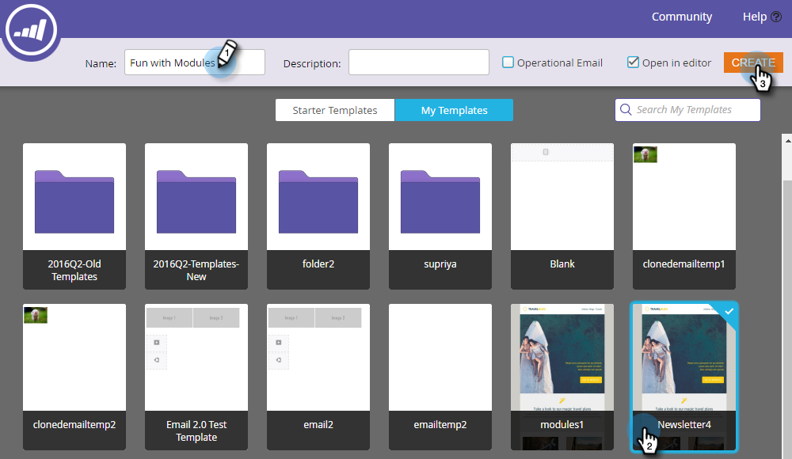
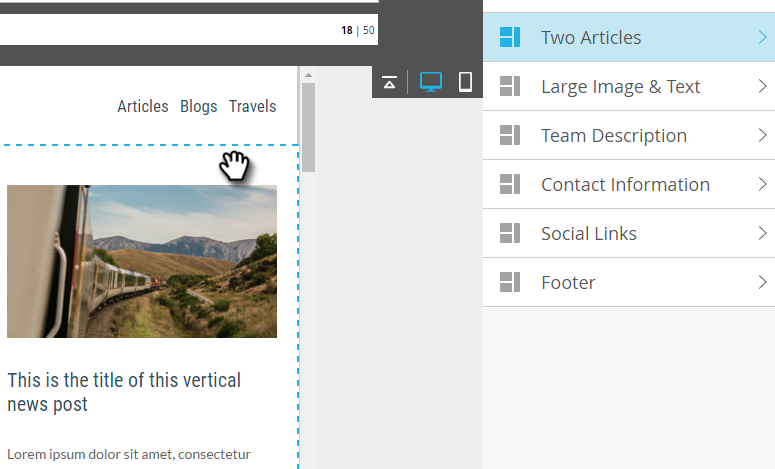
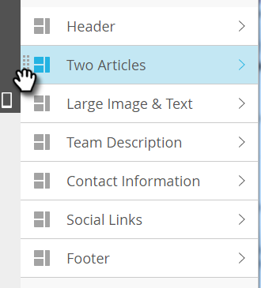

# Lägg till moduler i din e-post {#add-modules-to-your-email}

I e-postredigeraren 2.0 är en modul en del av e-postmeddelandet som definieras i mallen. Moduler kan innehålla valfri kombination av element, variabler och annat HTML-innehåll. Det är enkelt att lägga till dem i e-postmeddelandet.

1. Skapa ett e-postmeddelande. Var noga med att välja (eller skapa) en mall som innehåller moduler.

   

   >[!NOTE]
   >
   >De flesta av Marketo Starter-mallarna innehåller moduler. Du kan också [skapa egna](http://docs.marketo.com/display/DOCS/Email+Template+Syntax#EmailTemplateSyntax-Modules).

1. Klicka på **Moduler** till höger om e-postmeddelandet.

   

1. Välj den modul som du vill lägga till och dra den över till e-postmeddelandet.

   

1. När du drar modulen över visas &quot;Släpp här&quot; mellan de andra modulerna. Släpp den nya modulen där du vill.

   

1. Vänta några sekunder så uppdateras e-postmeddelandet automatiskt och visar den modul du har lagt till.

   

## Flytta en modul i ett e-postmeddelande {#moving-a-module-within-an-email}

Det finns två sätt att flytta en modul.

1. Identifiera modulen som du vill flytta. Om du är osäker på vad det heter håller du pekaren över det så markeras det till höger.

   

1. Håll pekaren över modulen till höger för att visa handtaget. Ta den...

   

1. ...och dra modulen dit du vill ha den.

   

1. Den andra metoden är att klicka på modulen i e-postmeddelandet för att markera den och visa kugghjulsikonen.

   

1. Klicka på kugghjulsikonen och välj **Flytta uppåt** eller **Flytta nedåt**, beroende på var du vill att modulen ska placeras.

   

Det är allt som finns för det.

>[!MORELIKETHIS]
>
>[Syntax för e-postmall](email-template-syntax.md)

