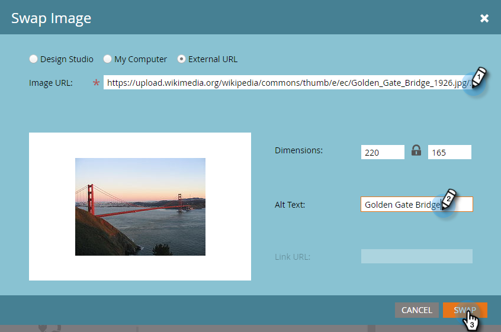
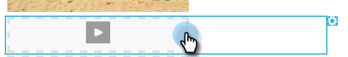

# Redigera element i ett e-postmeddelande {#edit-elements-in-an-email}

E-postmeddelanden kan innehålla fyra olika element: RTF, bilder, kodfragment och video. Så här redigerar du varje bild.

## Så här redigerar du RTF-elementet {#how-to-edit-the-rich-text-element}

1. Leta upp e-postmeddelandet, markera det och klicka på **Redigera utkast**.

   

1. E-postredigeraren öppnas. Markera RTF, klicka på kugghjulsikonen och välj **Redigera**.

   

   Du kan också hovra över elementet i den högra rutan, så att kugghjulsikonen visas.

   

1. Lägg till/redigera texten och tryck på **Spara**.

   

   >[!NOTE]
   >
   >**Påminnelse**
   >
   >
   >Du kan också lägga till bilder, variabler, tabeller och andra element. Se [Använda RTF-redigeraren](../../../../product-docs/email-marketing/general/understanding-the-email-editor/using-the-rich-text-editor.md).

   >[!CAUTION]
   >
   >Undvik att kopiera och klistra in text från en rik textkälla, t.ex. en webbplats eller ett Word-dokument. Klistra i stället in RTF-text i en vanlig textredigerare, till exempel Anteckningar (Windows) eller TextEdit (Mac). När det är&quot;rent&quot; kan du sedan kopiera det från textredigeraren och klistra in det i e-postmeddelandet.

## Redigera bildelementet {#how-to-edit-the-image-element}

1. Klicka i modulen med bildelementet för att markera det.

   

1. Klicka på det bildelement som du vill redigera, klicka sedan på kugghjulsikonen och välj **Redigera**.

   

   >[!NOTE]
   >
   >Du kan också dubbelklicka på elementet för att börja redigera det.

1. Bildredigeraren visas.

   

   Du kan infoga en bild på tre olika sätt. Vi tittar på vart och ett.

   **Extern URL**

   >[!NOTE]
   >
   >Använd det här alternativet om du vill använda en Marketo-token. Tänk på att när du använder en variabel kommer bilden att visas som skadad i redigeraren, men den kommer att återges i förhandsgranskningsläget och i e-postmeddelandet med sändningsexemplet.

   **Växla** 

   **Den här datorn**

   Klicka på **Bläddra** om du vill överföra en bild från datorn.

   

   Navigera till den plats där bilden finns på datorn och infoga den.

   

   Ändra dimensionerna efter dina behov, ändra Alt-texten (valfritt) och tryck sedan på **Växla**.

   

   >[!NOTE]
   >
   >Om du ersätter en bild måste du markera rutan **Skriv över befintlig bild** som visas under bildens URL/namn.

   **Design** StudioOm du vill infoga en bild från Design Studio letar du reda på den...

   

   **Växla**
   

Om du vill använda en extern URL klistrar du först in bildens URL. Ändra dimensionerna efter dina behov och lägg till Alt-text (valfritt). Tryck sedan på .               ...och infoga den. Ändra dimensionerna efter dina behov, ändra Alt-texten (valfritt) och tryck sedan på .

## Redigera fragmentelementet {#how-to-edit-the-snippet-element}

1. Klicka i modulen med fragmentelementet.

   

1. Klicka på fragmentelementet, klicka på kugghjulsikonen och välj **Redigera**.

   

1. Hitta fragmentet, markera det och klicka på **Spara**.

   

1. Ditt fragment fylls sedan i.

   

## Så här redigerar du videoelementet {#how-to-edit-the-video-element}

1. Klicka i modulen med Video-elementet.

   

1. Klicka på videoelementet, klicka på kugghjulsikonen och välj **Redigera**.

   

1. Klistra in video-URL:en från Vimeo eller YouTube. Klicka sedan utanför URL-rutan för att läsa in förhandsgranskningen. Ändra dimensionerna efter dina behov, lägg till Alt-text (valfritt) och tryck sedan på **Infoga**.

   

   >[!NOTE]
   >
   >För YouTube-videofilmer används den fullständiga URL:en från adressfältet, inte den genväg-URL som finns i alternativet Dela.

Ha så kul när du utformar den perfekta e-postadressen!
