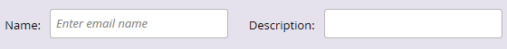

# Översikt över väljaren för e-postmall {#email-template-picker-overview}

När du [skapar ett e-postmeddelande](../../../../product-docs/email-marketing/general/creating-an-email/create-an-email.md)har du flera kostnadsfria mallar att välja bland. Du kan också skapa en egen mall och spara den för framtida bruk.

**Namnet** är namnet på det e-postmeddelande som du skapar baserat på mallen, inte själva mallen. **Beskrivningen** gäller även för e-postmeddelandet och är valfri.

Om din e-post är viktig och du vill att den ska kringgå kommunikationsbegränsningar [kan du aktivera](../../../../product-docs/email-marketing/general/functions-in-the-editor/make-an-email-operational.md) den genom att markera kryssrutan. **Öppna i redigeraren** är markerat som standard, vilket innebär att du vill börja redigera ditt nya e-postmeddelande direkt. **Skapa** medel, skapa!

**Startmallar** innehåller en samling färdiga responsiva e-postmallar. Du kan använda dem som de är eller anpassa dem efter dina önskemål.

>[!NOTE]
>
>Marketos startmallar erbjuds alla kunder utan extra kostnad. De uppdateras kontinuerligt och optimeras för större e-postklienter (och mobila enheter), men du bör alltid utvärdera om de uppfyller dina behov. Marketos [e-postleveransverktyg](http://docs.marketo.com/display/DOCS/Email+Deliverability+Tool) kan visa hur du återger mallar på olika e-postklienter. Marketo kan tyvärr inte göra designförfrågningar utanför betalda serviceåtaganden.

**Mina mallar** består av alla mallar du har skapat. Du kan också ha mappar.   

Alla mappar som visas under E-post > Mallar i ditt Design Studio-träd finns i **Mina mallar**.

Om du vill förhandsgranska en mall håller du pekaren över miniatyrbilden och klickar på **Förhandsgranska**. Du kan också bara dubbelklicka på den.

Förhandsgranskaren visar hur mallen kommer att återges på en stationär dator...

...och en mobil enhet.

Om du gillar den här mallen väljer du den genom att klicka på **Markera** längst ned till höger. Vill du fortsätta leta? Klicka på **X** i det övre högra hörnet. Använd vänster- och högerpilarna för att bläddra igenom mallar.

Du kan också högerklicka på en mallminiatyrbild om du vill se fler alternativ.

>[!NOTE]
>
>En cool sak med mallminiatyrbilder är att de är aktiva. Om du ändrar en mall ändras alltså även miniatyrbilden.

Vackert!

>[!NOTE]
>
>**Relaterade artiklar**
>
>* [Syntax för e-postmall](email-template-syntax.md)
>* [Skapa ett e-postmeddelande](../../../../product-docs/email-marketing/general/creating-an-email/create-an-email.md)

>

