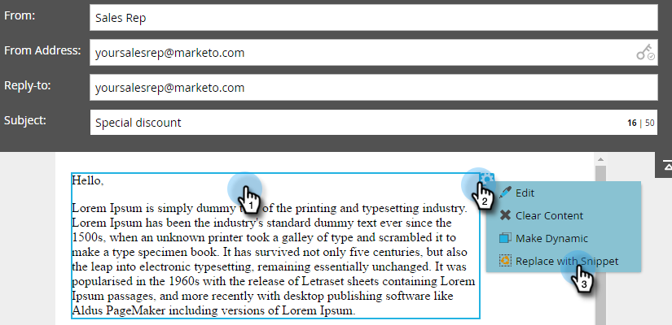

# Lägga till ett kodfragment i ett e-postmeddelande {#add-a-snippet-to-an-email}

Kodavsnitt är återanvändbara block med text och grafik som du kan använda i e-postmeddelanden och på landningssidor.

>[!PREREQUISITES]
>
>[Skapa ett fragment](/help/marketo/product-docs/personalization/segmentation-and-snippets/snippets/create-a-snippet.md)

>[!NOTE]
>
>Du kan inte bädda in [Marketo-e-](/help/marketo/product-docs/email-marketing/general/email-editor-2/email-template-syntax.md)postsyntaxfragment; det kommer **inte** att fungera i ett e-postmeddelande. Kodavsnitt ska bara innehålla brödtext (HTML + TEXT).

1. Leta upp e-postmeddelandet, markera det och klicka på **Redigera utkast**.

   

1. Markera det redigerbara område som du vill konvertera till ett fragment, klicka på kugghjulsikonen och välj **Ersätt med fragment**.

   

1. Markera det fragment du vill använda och klicka på **Spara**.

   

   >[!NOTE]
   >
   >Endast godkända fragment visas i listrutan.

   

   >[!NOTE]
   >
   >Varje gång du uppdaterar och godkänner fragmentet visas ändringarna i e-postmeddelandet. E-postmeddelandet skrivs ut om du inte godkänner kodavsnittet med [No-Draft](/help/marketo/product-docs/administration/users-and-roles/managing-user-roles-and-permissions/enable-no-draft-for-snippets.md).

Det här är ett snabbt och enkelt sätt att återanvända dynamiskt innehåll.
