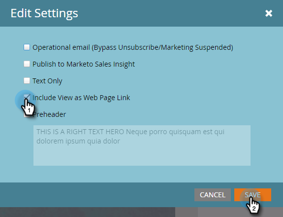

# Lägg till en länk för Visa som webbsida i ett e-postmeddelande {#add-a-view-as-web-page-link-to-an-email}

E-postmeddelanden har begränsade funktioner (begränsad CSS och inga JavaScript eller formulär). Använd Visa som webbsida om du vill skapa en länk för att visa din e-post i en webbläsare. Detta gör att mottagaren cookie använder Munchkin.

>[!NOTE]
>
>Visa som webbsida är inte aktiverat när du skapar ett nytt e-postmeddelande. Om du aktiverar den och klonar e-postmeddelandet kopieras den här inställningen.

1. Välj e-post och klicka **Redigera utkast**.

   

1. I e-postredigeraren klickar du på **E-postinställningar**.

   

1. Kontrollera **Inkludera vy som webbsida** och klicka **Spara**.

   

Här är ett exempel på hur det ser ut:

>[!TIP]
>
>Du kommer inte att se länken Visa som webbsida förrän du skickar e-postmeddelandet. Skicka dig själv ett test att titta på.

Information om hur du ändrar standardtexten finns i [Redigera meddelandet&quot;Visa som webbsida&quot;](/help/marketo/product-docs/administration/email-setup/edit-the-view-as-web-page-message.md).
