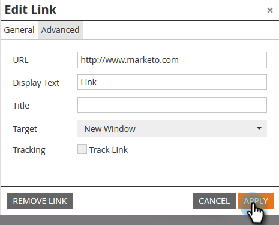

# Inaktivera spårning för en e-postlänk {#disable-tracking-for-an-email-link}

Ibland vill du inte aktivera **Marketo Tracking URL** på en länk i ett e-postmeddelande. Detta är användbart när målsidan inte stöder URL-parametrar och kan resultera i en bruten länk.

1. Välj e-post och klicka **Redigera utkast**.

   

1. Dubbelklicka på det redigerbara avsnitt som innehåller länken.

   

1. Klicka på länken i fråga och klicka sedan på **Infoga/redigera länk** -knappen.

   

1. Avmarkera alternativet i popup-fönstret Redigera länk **Spåra länk** kryssrutan.

   

1. Du kommer att märka **Inkludera mkt_tok, ruta** försvinner. Klicka **Använd**.

   

   >[!TIP]
   >
   >Avmarkerar **Inkludera mkt_tok** tillåter fortfarande att länken spåras, men efter omdirigeringen kommer mål-URL:en inte att innehålla frågesträngsparametern mkt_tok. Den här parametern används av Marketo Landing Pages och Munchkin för att säkerställa korrekt spårning av personaktiviteter (som när en person säger upp prenumerationen på ett e-postmeddelande). Du bör undvika att använda den här funktionen om du inte ser något konstigt beteende på webbplatsen på grund av att parametern finns.

1. Klicka **Spara**.

   

   >[!TIP]
   >
   >Vill inaktivera klickspårning för en länk i ett e-postmeddelande **mall**? Använd det här formatet:
   >`<a class="mktNoTrack" href="https://www.mywebsite.com">This link does not have tracking</a>`\
   >Kontakta din webbutvecklare om du behöver hjälp med att implementera detta.

Snyggt! Du har nu inaktiverat spårning för en länk.
