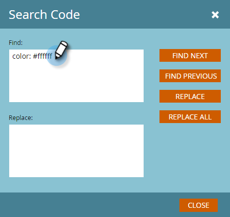

# Redigera HTML {#edit-an-emails-html} för ett e-postmeddelande

Ibland kan du behöva ändra ett e-postes underliggande HTML. Ibland kan du använda ett externt system för att utforma och bygga din e-postkod. Oavsett vilket kan du enkelt importera och/eller redigera kod i e-postredigeraren.

## Redigera HTML {#edit-html}

1. Markera e-postmeddelandet och klicka på **Redigera utkast**.

   

1. Klicka på **Redigera kod**.

   

1. Gör ändringar. Klicka på **Spara** när du är klar.

   

   >[!NOTE]
   >
   >Ändra vad du vill. Du kan ersätta hela HTML-koden eller göra mindre justeringar.

1. Klicka på listrutan **Kodåtgärder** om du vill hämta koden som en .html-fil, infoga CSS-koden eller validera HTML-koden.

   

   >[!NOTE]
   >
   >Det bästa sättet att använda e-post är att göra alla format textbundna. Flera e-postklienter saknar stöd för CSS i `<head>`-avsnittet.

## Bryta ett e-postmeddelande från dess mall {#breaking-an-email-from-its-template}

Dessa kodändringar **kommer inte att bryta ett e-postmeddelande från mallen:**

* Redigera innehållet i en modul (inklusive att lägga till nya element i modulen)
* Lägga till en ny modul i behållaren
* Ta bort en modul från behållaren

* Ändra mkto-specifika attribut (till exempel&quot;mktoName&quot; eller&quot;mktoImgUrl&quot;) för element utanför en modul
* Redigera innehållet i ett element (RTF, bild, video osv.) utanför en modul

Dessa saker som du kan göra i kodredigeraren **kommer** att bryta e-postmeddelandet från dess mall:

* Ändra vad som helst i koden utanför ett element eller en modul
* Lägga till eller ändra icke-mkto-attribut (till exempel&quot;id&quot; eller&quot;style&quot;) för ett element utanför en modul
* Ta bort ett element som ligger utanför en modul

## Sökkod {#search-code}

Använd funktionen Sök kod för att effektivt söka efter och ersätta innehåll i e-postens HTML-kod.

1. Klicka på **Sök kod** i e-postkoden.

   

1. Ange vad du vill söka efter och klicka på **Sök nästa** för att söka framåt eller **Sök föregående** för att söka bakåt. Du kan också välja **Ersätt** och **Ersätt alla**.

   

1. Klicka på **Stäng** när du är klar.

   

   >[!NOTE]
   >
   >Sökkoden finns också i [e-postmallsredigeraren](/help/marketo/product-docs/email-marketing/general/email-editor-2/create-an-email-template.md).

Vi rekommenderar att du fortsätter att redigera dina e-postmeddelanden med hjälp av Marketos inbyggda funktioner, men den här kodredigeraren erbjuder flexibilitet om du behöver det.
