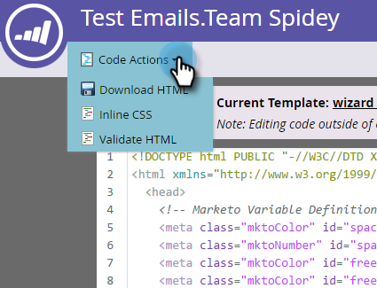

# Redigera HTML för ett e-postmeddelande {#edit-an-emails-html}

Ibland kan du behöva ändra e-postmeddelandets underliggande HTML. Ibland kan du använda ett externt system för att utforma och bygga din e-postkod. Oavsett vilket kan du enkelt importera och/eller redigera kod i e-postredigeraren.

## Redigera HTML {#edit-html}

1. Välj e-post och klicka **Redigera utkast**.

   

1. Klicka **Redigera kod**.

   

1. Gör ändringar. Klicka **Spara** när det är klart.

   

   >[!NOTE]
   >
   >Ändra vad du vill. Du kan ersätta hela HTML eller göra mindre justeringar.

1. Klicka på **Kodåtgärder** för att ladda ned koden som en HTML-fil, infoga CSS-koden eller validera HTML.

   

   >[!NOTE]
   >
   >Det bästa sättet att använda e-post är att göra alla format textbundna. Flera e-postklienter saknar stöd för CSS i `<head>` -avsnitt.

## Bryta ett e-postmeddelande från dess mall {#breaking-an-email-from-its-template}

Dessa kodändringar **inte** bryta ett e-postmeddelande från mallen:

* Redigera innehållet i en modul (inklusive att lägga till nya element i modulen)
* Lägga till en ny modul i behållaren
* Ta bort en modul från behållaren

* Ändra mkto-specifika attribut (till exempel&quot;mktoName&quot; eller&quot;mktoImgUrl&quot;) för element utanför en modul
* Redigera innehållet i ett element (RTF, bild, video osv.) utanför en modul

Det här kan du göra i kodredigeraren **kommer** bryta e-postmeddelandet från mallen:

* Ändra vad som helst i koden utanför ett element eller en modul
* Lägga till eller ändra icke-mkto-attribut (till exempel&quot;id&quot; eller&quot;style&quot;) för ett element utanför en modul
* Ta bort ett element som ligger utanför en modul

## Sök kod {#search-code}

Använd sökkodsfunktionen för att effektivt söka efter och ersätta innehåll i e-postmeddelandets HTML-kod.

1. Klicka i e-postkoden på **Sök kod**.

   

1. Ange vad du vill hitta och klicka **Sök nästa** för att söka framåt eller **Sök föregående** för att söka bakåt. Du kan också välja att **Ersätt** och **Ersätt alla**.

   

1. Klicka **Stäng** när det är klart.

   

   >[!NOTE]
   >
   >Sökkoden finns också i [Redigerare för e-postmall](/help/marketo/product-docs/email-marketing/general/email-editor-2/create-an-email-template.md).

Vi rekommenderar att du fortsätter att redigera dina e-postmeddelanden med Marketo inbyggda funktioner, men den här kodredigeraren erbjuder flexibilitet om du behöver det.
