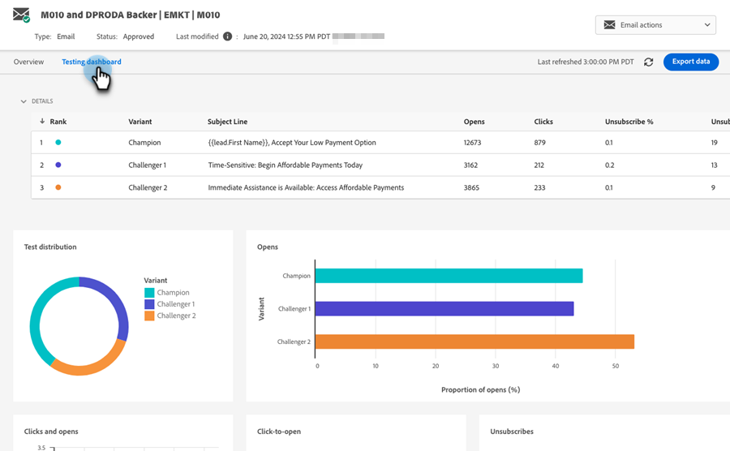

# Champion/Challenger: Analytics {#champion-challenger-analytics}

Få rapportvarningar och/eller gå igenom Champion/Challenger-instrumentpanelen för att få hjälp med analys.

>[!PREREQUISITES]
>
>[Champion/Challenger: Definiera Champion-villkor](/help/marketo/product-docs/email-marketing/general/functions-in-the-editor/email-tests-champion-challenger/champion-challenger-define-champion-criteria.md)

## Konfigurera rapportaviseringar {#configure-report-alerts}

Marketo skickar rapporter om hur e-posttestet går. Så här schemalägger du det.

1. Vi schemalägger rapporten att skicka en gång i veckan på fredag kl. 9.00.

   

   >[!TIP]
   >
   >Du kan markera flera dagar i veckan om du vill. Klicka för att markera och klicka igen för att avmarkera.

1. Ange den eller de e-postadresser som du vill att rapporterna ska skickas till.

   

1. Klicka på **Nästa**.

   

1. Kontrollera att all information är korrekt och klicka på **Stäng**.

   

   Rapporten innehåller bland annat information om testtyp, vinnarvillkor, antal e-postöppningar och annat. Det finns också en direktlänk till själva testet, där du kan förklara vinnaren! Häftiga saker.

## Champion/Challenger Dashboard {#champion-challenger-dashboard}

Kontrollpanelen Champion/Challenger ger detaljerad analys av prestanda för kontrollen och varianter i dina Champion/Challenger-experiment (öppnar, klickar, avbryter prenumerationen i procent och andra variabler som används under konfigurationen av e-posttestet). Kontrollpanelen innehåller också distributionsinformation om målgruppen för olika e-postvarianter, samt aggregerad andel för öppningar, klick, förhållandet mellan klickningar och öppningar och för att avbryta prenumerationen för alla varianter.

