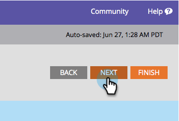

# Champion/Challenger: Konfigurera rapportaviseringar {#champion-challenger-configure-report-alerts}

Marketo skickar rapporter om hur e-posttestet går. Så här schemalägger du det.

>[!PREREQUISITES]
>
>[Champion/Challenger: Definiera villkor för tävling](/help/marketo/product-docs/email-marketing/general/functions-in-the-editor/email-tests-champion-challenger/champion-challenger-define-champion-criteria.md)

1. Vi schemalägger rapporten att skicka en gång i veckan på fredag kl. 9.00.

   

   >[!TIP]
   >
   >Du kan markera flera dagar i veckan om du vill. Klicka för att markera och klicka igen för att avmarkera.

1. Ange den eller de e-postadresser som du vill att rapporterna ska skickas till.

   

1. Klicka **Nästa**.

   

1. Kontrollera att all information är korrekt och klicka på **Stäng**.

   

   Rapporten kommer att innehålla användbara detaljer, som: testtyp, vinnarvillkor, antal e-postöppningar med mera. Det finns också en direktlänk till själva testet, där du kan förklara vinnaren! Häftiga saker.

   >[!MORELIKETHIS]
   >
   >[Champion/Challenger: Godkänn ditt e-posttest](/help/marketo/product-docs/email-marketing/general/functions-in-the-editor/email-tests-champion-challenger/champion-challenger-approve-your-email-test.md)
