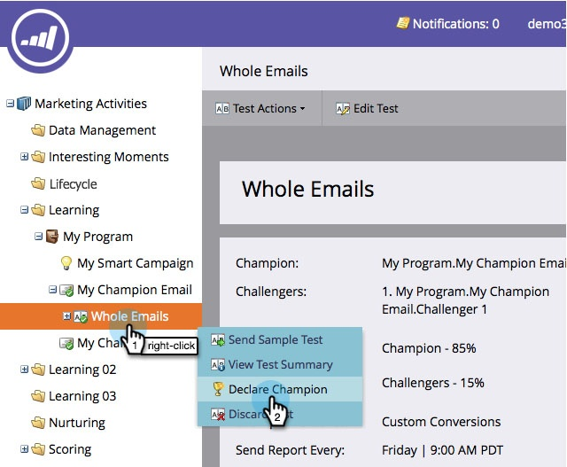
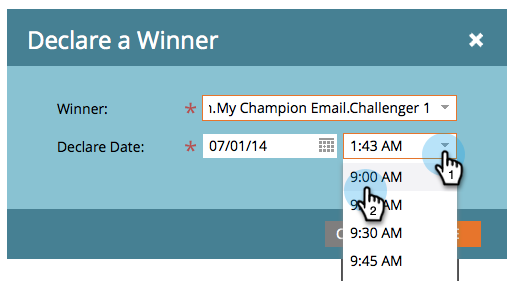

# Champion/Challenger: Deklarera en mästare {#champion-challenger-declare-a-champion}

När du är klar kan du deklarera en kampanj för ditt e-posttest.

>[!MORELIKETHIS]
>
>[Champion/Challenger: Godkänn ditt e-posttest](/help/marketo/product-docs/email-marketing/general/functions-in-the-editor/email-tests-champion-challenger/champion-challenger-approve-your-email-test.md)

1. Gå till **[!UICONTROL Marketing Activities]**.

   

1. Sök efter och högerklicka på ditt e-posttest och klicka sedan på **[!UICONTROL Declare Champion]**.

   

1. Välj önskad **[!UICONTROL Winner]**.

   

1. Ange **[!UICONTROL Declare Date]**.

   >[!NOTE]
   >
   >Fram till **[!UICONTROL Declare Date]** kommer Marketo att fortsätta skicka den eller de gamla motståndarna. När datum/tid är nådd skickas bara den nya segraren.

   

   >[!CAUTION]
   >
   >Observera att standardvärdet **[!UICONTROL Declare Date]** är i morgon, inte i dag.

1. Välj en tid och klicka på **[!UICONTROL Save]**.

   

   Rad! Nu vet ni hur enkelt det är att köra ett e-posttest för att förbättra ert innehåll utan avbrott i er kampanj.
