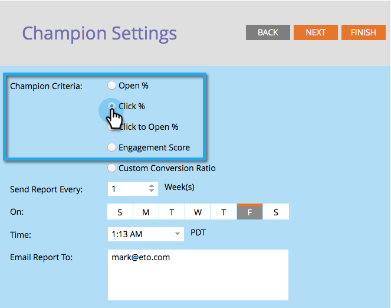

# Champion/Challenger: Definiera villkor för tävling {#champion-challenger-define-champion-criteria}

När du har konfigurerat testtypen måste du definiera tävlingskriterierna. Så här gör du.

>[!NOTE]
>
>**Förutsättningar**
>
>* [Lägg till en e-postkampanj/kanal](add-an-email-champion-challenger.md)

>

## Standardvillkor för tävling {#standard-champion-criteria}

1. Välj ett av de tillgängliga **tävlingsvillkoren**.

   

   >[!NOTE]
   >
   >Vi håller reda på mätvärdena och skickar en rapport med data via e-post.

1. Om du valde något av standardvillkoren för **tävling** går du vidare till [Champion/Challenger: Konfigurera rapportaviseringar](champion-challenger-configure-report-alerts.md)!

## Anpassade villkor för tävling {#custom-champion-criteria}

1. Om du vill bli snygg kan du anpassa genom att välja **Anpassad konvertering** och klicka på **Redigera**.

   

   >[!NOTE]
   >
   >På så sätt kan du ange vilken händelse som helst som en konvertering genom att använda utlösare och filter.

1. Ett fönster öppnas - hitta den utlösare du vill ha och dra den till arbetsytan.

   

1. Definiera utlösaren.

   

   Marketo tillåter bara utlösare för personer som har fått e-postmeddelandet från det här e-postprogrammet. Du behöver inte lägga till filtret&quot;Skickat e-post&quot;.

1. Klicka på **Stäng**.

   

   Bra! Nu är det dags att planera rapporten.

   >[!NOTE]
   >
   >**Relaterade artiklar**
   >
   >    
   >    
   >    * [Champion/Challenger: Konfigurera rapportaviseringar](champion-challenger-configure-report-alerts.md)

