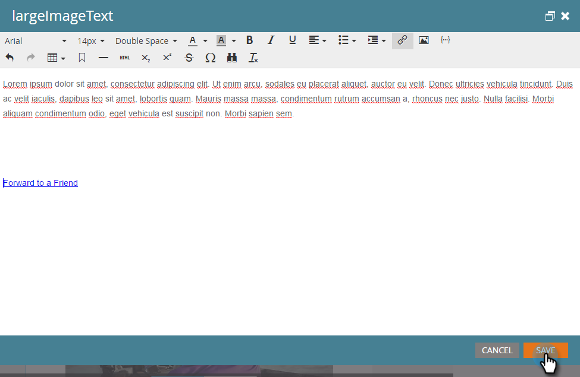

# Vidarebefordra till en länk i e-postmeddelanden {#forward-to-a-friend-link-in-emails}

Genom att lägga till länken Vidarebefordra till vän i dina e-postmeddelanden kan du spåra personer som har fått ett vidarebefordrat e-postmeddelande via den här länken och automatiskt lägga till dem som en ny person om de inte redan finns i databasen.

Exempel: Keith använder länken&quot;Vidarebefordra till vän&quot; för att vidarebefordra e-postmeddelandet till en okänd person, Mark. Mark läggs automatiskt till som en ny person, tilldelas sin egen cookie och hans e-post och webbaktiviteter länkas till honom. Men om Keith använder framåtknappen i sin e-postklient, så kommer Mark felaktigt att kodas som Keith och hans aktivitet loggas som Keith.

>[!NOTE]
>
>**FYI**
>
>Marketo standardiserar nu språk för alla prenumerationer, så du kan se lead/leads i din prenumeration och person/personer på docs.marketo.com. Dessa termer betyder samma sak. det påverkar inte artikelinstruktionerna. Det finns andra förändringar också. [Läs mer](http://docs.marketo.com/display/DOCS/Updates+to+Marketo+Terminology).

## Lägg till länken i en e-postmall {#add-the-link-to-an-email-template}

1. Gå till **Design Studio**.

   

1. Sök efter och välj den e-postmall som du vill lägga till länken i. Klicka på **Redigera utkast**.

   

1. Klistra in följande HTML-kod där du vill att länken &quot;Vidarebefordra till vän&quot; ska visas (om du behöver hjälp med den här delen kontaktar du webbutvecklaren):

   `<pre data-theme="Confluence"><a href="{{system.forwardToFriendLink}}">Forward to Friend</a></pre>`

   

   >[!TIP]
   >
   >
   >Du kan lägga till format i länken för att den ska se trevligare ut. Till exempel:
   >
   >`<a href="{{system.forwardToFriendLink}}" style="font-family:arial, sans-serif; padding:10px; position:absolute; right:0px;">Forward to Friend</a>`

   >[!CAUTION]
   >
   >Vi rekommenderar inte att du använder **formatpositionen:relative** i din e-postmall. Det kan skapa problem med placeringen och visningen av rutan Vidarebefordra till vän.

1. Klicka på **Förhandsgranska utkast** för att kontrollera att mallen ser ut som du vill ha den.

   

   >[!NOTE]
   >
   >**Påminnelse**
   >
   >Kom ihåg att godkänna mallutkastet för att tillämpa ändringarna.

   Alla e-postmeddelanden som använder den mallen får nu länken Vidarebefordra till vän. När e-postmottagaren klickar på den hämtas de till en webbversion av e-postmeddelandet med rutan Vidarebefordra till en vän:
   

## Lägg till länken i ett enskilt e-postmeddelande {#add-the-link-to-an-individual-email}

Du kan också lägga till länken Vidarebefordra till vän direkt i ett e-postmeddelande.

1. Öppna det e-postmeddelande som du vill ta med länken i och dubbelklicka i det redigerbara området.

   

1. Placera markören där du vill att länken ska visas och klicka på knappen **Infoga token** .

   

1. Välj **`{{system.forwardToFriendLink}}`** token.

   

   >[!NOTE]
   >
   >Detta token är webbadressen för webbversionen av e-postmeddelandet med rutan Vidarebefordra till vän.

1. Skriv vad du vill att visningstexten för länken ska vara (till exempel &quot;Vidarebefordra till en vän&quot;).

   

1. Klipp ut **`{{system.forwardToFriendLink}}`** token med Ctrl+X (Windows) eller Cmd+X (Mac). Markera&quot;Framåt till en vän&quot; och klicka på knappen **Infoga/redigera länk** .

   

1. Klistra in **`{{system.forwardToFriendLink}}`** token i **URL** -rutan med Ctrl/Cmd+V och klicka sedan på** Infoga**.

   

1. Spara redigeringen och förhandsgranska den nya länken!

   

   >[!NOTE]
   >
   >Nya personer som läggs till genom att de får ett&quot;Vidarebefordra till en vän&quot;-e-postmeddelande är som standard avbeställda från marknadsföring via e-post.

## Visa vidarebefordringsaktivitet {#view-forwarding-activity}

Du kan se vem som vidarebefordrat och tagit emot e-postmeddelanden i personens aktivitetslogg.

1. Gå till **`Database`**.

   

1. Dubbelklicka på den person som du vill visa aktivitet för.

   

1. Gå till fliken **Aktivitetslogg** . Dubbelklicka på **Mottaget vidarebefordrat till väns-e-post** eller **Skickat framåt till väns-e-post** om du vill se information.

   

   >[!NOTE]
   >
   >**Definition**
   >
   >
   >För Mottaget vidarebefordrat till väns-e-post är person-ID den person som vidarebefordrade e-postmeddelandet.
   >
   >
   >För Skickat Vidarebefordra till väns-e-post är person-ID den person som tog emot e-postmeddelandet.

   

1. Om du vill visa en person efter ID kopierar och klistrar du in ID:t*** till slutet av URL:en (början av URL:en beror på din Marketo-instans):

   `<pre data-theme="Confluence">...marketo.com/Database/loadPersonDetail?personId=</pre>`

   >[!NOTE]
   >
   >Vi gör det möjligt för **person-ID** att klickas och länka direkt till personen i en kommande korrigering.

   

   >[!NOTE]
   >
   >Om den vän som tar emot vidarebefordran är en okänd person skapas en ny person med namnet&quot;Vidarebefordra till vän&quot;, som är markerad som personens **källa**.\
   >Om e-postmeddelandet är en lokal tillgång i ett program markeras programmet som personens **förvärvsprogram**.

## Utlös eller filtrera med hjälp av vidarebefordringsaktivitet {#trigger-or-filter-using-forwarding-activity}

Det finns sex utlösare/filter som du kan använda för att utlösa flödesåtgärder eller filtrera personer genom att skicka och ta emot aktiviteten Vidarebefordra till vän.

Om du söker efter &quot;framåt&quot; i en smart kampanjlista hittar du tillgängliga utlösare och filter.

## Testa framåt till vän {#test-forward-to-friend}

Om du vill testa Vidarebefordra till vän skickar du dig ett e-postmeddelande med länken Framåt. Se till att du skickar det genom **skicka e-post** -flödet, *inte* via **Skicka testmeddelande**.
