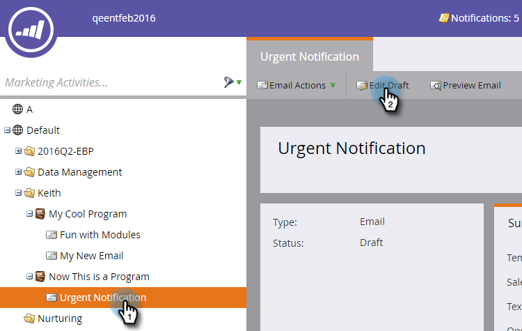

# Gör ett e-postmeddelande användbart {#make-an-email-operational}

E-postmeddelanden som används ignorerar statusen Avbeställ och Marknadsföring har avbrutits. De skickar oavsett vad.

>[!NOTE]
>
>E-post som används omfattas inte av kommunikationsbegränsningar.

1. Leta upp e-postmeddelandet, markera det och klicka på Redigera utkast.

>[!NOTE]
>
>**Påminnelse**
>
>Du bör bara använda driftmeddelanden för viktiga e-postmeddelanden och automatiska svar. De är inte avsedda för marknadsföring via e-post.

1. När redigeraren öppnas klickar du på **E-postinställningar**.

   

1. Kontrollera **e-postadress** och klicka på **Spara**.

   

>[!CAUTION]
>
>Operativa e-postmeddelanden har inte utformats för att fungera med engagemangsprogram. Ett engagemangsprogram kommer därför att ignorera ett e-postmeddelandes driftsstatus. Tänk på det när du arbetar med dem.

Glöm inte att godkänna det här e-postmeddelandet för att ändringarna ska börja gälla. Lär dig hur du [godkänner ett e-postmeddelande](../../../../product-docs/email-marketing/general/creating-an-email/approve-an-email.md).