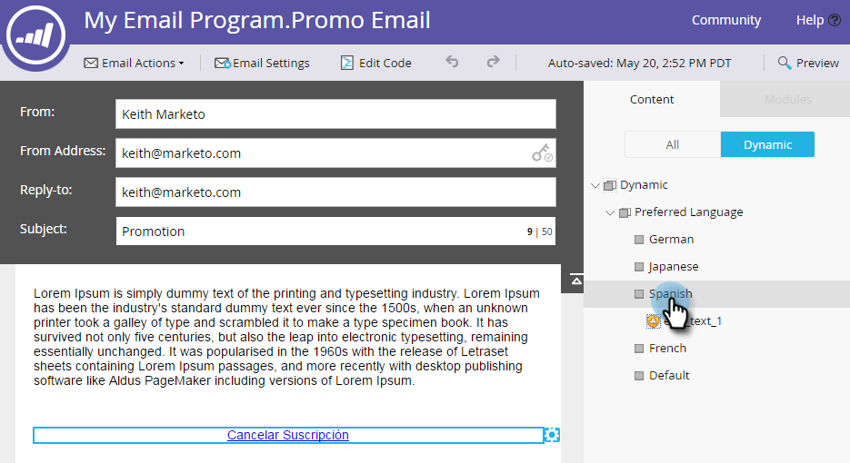

# Förhandsgranska ett e-postmeddelande med dynamiskt innehåll {#preview-an-email-with-dynamic-content}

Förhandsgranska e-postmeddelandet när du har lagt till dynamiskt innehåll för att verifiera det.

1. Markera din e-post och klicka på **Förhandsgranska e-post**.

   

1. Klicka på listrutan Visa efter och välj den typ av dynamiskt innehåll som du vill förhandsgranska.

   

1. En ny listruta visas. Klicka på den och välj det specifika innehållet.

   

1. Använd pilarna för att bläddra mellan alternativen.

   

Du kan också förhandsgranska dynamiskt innehåll direkt i e-postredigeraren.

1. Klicka på fliken **Dynamisk** under **Innehåll**.

   

1. Klicka på det innehåll du vill förhandsgranska.

   

Bra! Förhandsgranska dina e-postmeddelanden för att kontrollera att innehållet är som du vill ha det.
