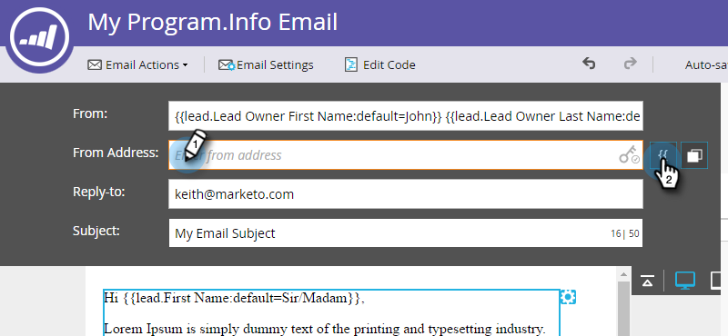

# Skicka e-post från lead-ägaren {#send-emails-from-the-lead-owner}

Vad händer om du vill skicka ett e-postmeddelande till en lead för leadägaren?  Så här gör du.

1. Leta upp e-postmeddelandet, markera det och klicka på **Redigera utkast**.

   

1. Klicka i fältet **Från** (ta bort ett befintligt namn) och klicka på knappen **Infoga token** .

   

1. Börja skriva &quot;`{{lead.Lead Owner`&quot; och välj **`{{lead.Lead Owner First Name}}`** token.

   

1. Ange ett standardvärde om leadet ännu inte har någon lead-ägare och klicka på **Infoga**.

   

1. Klicka efter den första variabeln, lägg till ett blanksteg och klicka sedan på knappen **Infoga token** .

   

1. Börja skriva &quot;`{{lead.Lead Owner`&quot; och välj **`{{lead.Lead Owner Last Name}}`** token.

   

1. Ange ett standardvärde om leadet ännu inte har någon lead-ägare och klicka på **Infoga**.

   

   >[!TIP]
   >
   >Se till att du har lagt till ett blanksteg mellan för- och efternamnstoken.

   Klicka i fältet Från e-post (ta bort en befintlig e-postadress) och klicka på knappen Infoga token.
   

1. Börja skriva &quot;`{{lead.Lead Owner`&quot; och välj **`{{lead.Lead Owner Email Address}}`** token.

   

1. Ange ett standardvärde om leadet ännu inte har någon lead-ägare och klicka på **Infoga**.

   

1. Se till att fälten **Svar till** och **Ämne** är ifyllda. Klart!

   

