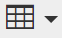

# Använda RTF-redigeraren {#using-the-rich-text-editor}

Textredigeraren (RTE) visas i hela Marketo och är tillgänglig när du vill lägga till eller redigera innehåll. Du kommer att se en version av den på landningssidor, program, e-post, formulär och utdrag. Klicka bara på **Redigera utkast** så öppnas det.

## Redigeringsinställningar {#editor-settings}

Rotblockelementets inställning definierar vilka taggar som omsluter innehållet. Som standard använder e-postrotelementet `
`-taggar. Du kan ändra det genom att följa stegen nedan.

>[!TIP]
>
>Även om du kan välja ditt rotblockselement rekommenderar vi alltid att du använder standardinställningarna för att få en så bra användarupplevelse som möjligt.

1. Klicka på **Admin**.

   

1. Klicka på **E-post**.

   

1. Klicka på **Redigera inställningar för textredigeraren**.

   

1. I listrutan **E-post-/fragmentredigerare** väljer du `
` eller Ingen och klickar på **Spara**. `
` används i det här exemplet.

   

   Om du har `

` i en e-postmall visas följande HTML-källbeteende när du öppnar avsnittet och skriver&quot;Text Goes Here&quot; i redigeraren:

<table> 
 <tbody> 
  <tr> 
   <th>&lt;p&gt;</th> 
   <th>&lt;div&gt;</th> 
   <th>Ingen</th> 
  </tr> 
  <tr> 
   <td>
&lt;div class="“mktEditable”"&gt; &lt;p&gt;Texten visas här&lt;/p&gt; &lt;/div&gt;
</td> 
   <td>
&lt;div class="“mktEditable”"&gt; &lt;div&gt;Texten visas här&lt;/div&gt; &lt;/div&gt;
</td> 
   <td>
&lt;div class="“mktEditable”"&gt; Texten visas här &lt;/div&gt;
</td> 
  </tr> 
 </tbody> 
</table>

>[!TIP]
>
>Du kan också ändra startssidredigerarens rotblockselement genom att följa samma steg, men klicka på listrutan **Landing Page Editor** i steg 4 i stället för i e-postredigeraren.

>[!NOTE]
>
>Rotblockelementet är alltid `
` för RTF-programtoken.

## Funktioner {#features}

Här är de funktioner du hittar i en RTE.

| Ikon | Namn | Vad det gör |
|---|---|---|
|  | Teckensnittsfamilj | Välj din stil - vi har massor! |
|  | Teckenstorlek | Hur stor vill du ha den? 25 alternativ, från 8 px till 90 px. |
|  | Stilar | Välj Stycke eller ett format med sex rubriker (för landningssidor). |
|  | Radavstånd | Välj avståndet mellan raderna. |
|  | Textfärg | Svart, röd eller vad du vill. |
|  | Bakgrundsfärg | Markera för att betona. |
|  | Fet | **Mörkare och tjockare**. |
|  | Kursiv | *Vinklad, för betoning eller* citat. |
|  | Understruken | Placerar en linje under texten. |
|  | Justering | Använd den här listrutan för att utforma text och bilder. Centrera dem, välj vänster- eller högerjustering eller lägg kanten på kanten med fullständig justering. |  |  | Lista | Välj punkter eller nummer i listrutan. Punkter är bra med listor och siffror med steg. |
|  | Indrag | Välj mer eller mindre indrag. Använd för stycken eller text som du vill sticka ut. |
|  | Infoga/redigera länk | Lägg in en länk till en webbplats eller annat innehåll. gör enkelt ändringar i den. |
|  | Infoga/redigera bild | En bild säger mer än tusen ord. Släpp in en. Klicka på kameraikonen för att bläddra i Design Studio. Du kan släppa bilder sida vid sida. |
|  | Infoga token | Ett kraftfullt verktyg som passar utmärkt för e-postpersonalisering och dataspårning. Var noga med att ange ett standardvärde. |
|  | Ångra | Oj då! Gå tillbaka ett steg och försök igen. |
|  | Gör om | Om det verkligen är okej, gå tillbaka till originalet. |
|  | Tabell | Bygg din egen, som den här. Med en nedrullningsbar meny kan du konfigurera den. |
|  | Infoga ankarpunkt | Släpp ankare! |
|  | Vågrät linje | Många användningsområden - Perfekt för att dela upp avsnitt. |
|  | Redigera HTML | Popup-fönstret för HTML-källkodsredigeraren så att du kan justera koden. |
|  | Nedsänkt | Låga hängande bokstäver (som i O`2`). |
|  | Upphöjd | Du har kraften! (2`6`). |
|  | Genomstruken | `<s>Put a line through text, like this</s>`. |
|  | Specialtecken | Vill du prata om euro? Matematik? Du har 243 val. |
|  | Sök och ersätt | Sök efter och ändra saker mycket snabbare än att leta efter varje instans själv. |
|  | Radera formatering | Återgå till standard. |
|  | Avbryt | Tryck på knappen för att säga &quot;Strunta i det.&quot; |
|  | Spara | Tryck på knappen för att säga &quot;OK, I like it.&quot; |

>[!TIP]
>
>Du kan redigera HTML och text på olika skärmar. Var noga med att klicka på **Kopiera från HTML** på fliken **Text** och sedan på **Spara** så att texten matchar HTML-koden.

>[!NOTE]
>
>Du är inte begränsad till teckensnitten i listrutan. Du kan använda en som inte finns med i listan genom att gå till HTML-koden. Alla webbteckensnitt stöds i Marketo, men webbteckensnitt fungerar inte överallt i alla e-postklienter.

## Landningssidor {#landing-pages}

Rotblockelementets inställning definierar vilka taggar som omsluter innehållet. Som standard använder rotblockselementet för landningssidan `
`-taggar. Du kan ändra det genom att följa stegen nedan.

>[!TIP]
>
>Även om du kan välja ditt rotblockselement rekommenderar vi alltid att du använder standardinställningarna för att få en så bra användarupplevelse som möjligt.

1. Klicka på **Admin**.

   

1. Klicka på **E-post**.

   

1. Klicka på **Redigera inställningar för textredigeraren**.

   

1. I listrutan **Landing Page Editor** väljer du `
` eller Ingen och klickar på **Spara**. `
` används i det här exemplet.

   

   Och det är allt!
