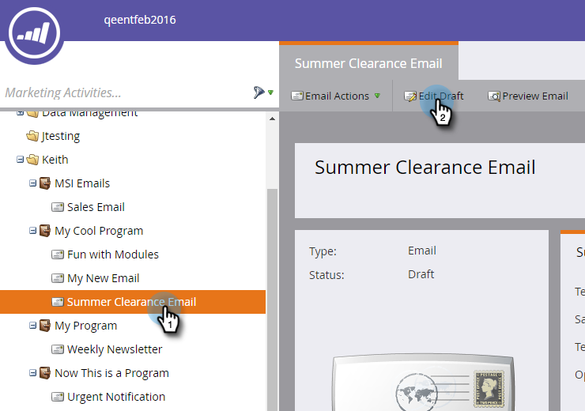
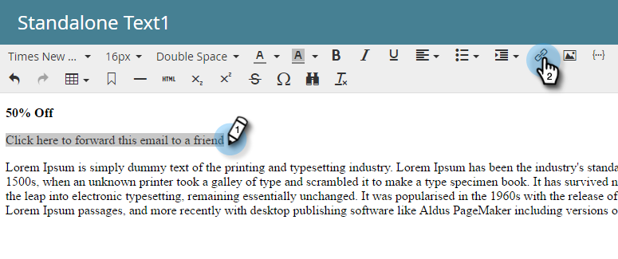
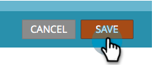

# Lägg till en systemtoken som en länk i ett e-postmeddelande {#add-a-system-token-as-a-link-in-an-email}

Du kan använda dessa systemtokens för att anpassa positionen för särskilda länkar i dina e-postmeddelanden.

Följande variabler kan användas som länkar i en e-postmall eller e-postmall:

* `{{system.forwardToFriendLink}}`
* `{{system.unsubscribeLink}}`
* `{{system.viewAsWebpageLink}}`

>[!NOTE]
>
>Dessa variabler kommer att **not** klickbara om de inte finns inuti en ankarlänk. Dessutom kan de **not** vara inbäddad i en My Token.

Så här lägger du till dem i ett e-postmeddelande:

1. Sök och välj e-postadress och klicka sedan på **Redigera utkast**.

   

1. Dubbelklicka i ett redigerbart område.

   

1. Markera den text som du vill konvertera till en länk med variabeln och klicka på knappen **Infoga/redigera länk** -knappen.

   

1. Ange token i länkens URL och klicka på **Infoga**.

   

   >[!TIP]
   >
   >Kopiera/klistra in den token du vill använda: **`{{system.forwardToFriendLink}}`** eller **`{{system.unsubscribeLink}}`** eller **`{{system.viewAsWebpageLink}}`**

1. Klicka **Spara**.

   

>[!IMPORTANT]
>
>Om du använder den här metoden för att lägga till systemtoken &quot;viewAsWebpageLink&quot; kan du **not** åsidosätt den med hjälp av variabler. Använd i stället [Lägg till en länk för Visa som webbsida i ett e-postmeddelande](/help/marketo/product-docs/email-marketing/general/functions-in-the-editor/add-a-view-as-web-page-link-to-an-email.md) som gör att du kan åsidosätta viewAsWebPageLink med hjälp av variabler.

>[!NOTE]
>
>Glöm inte att [godkänna din e-post](/help/marketo/product-docs/email-marketing/general/creating-an-email/approve-an-email.md) när det är klart.

Snyggt gjort! Nu vet du hur du lägger till en systemtoken som en länk i ett e-postmeddelande.
