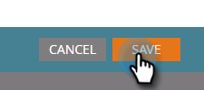

# Lägg till token i en e-postlänk {#add-tokens-to-an-email-link}

Om du vill infoga extra och personspecifika parametrar i länkarna kan du använda variabler. Så här gör du.

1. Markera din e-postadress och klicka på fliken **[!UICONTROL Edit Draft]**.

   

1. Dubbelklicka på ett redigerbart område.

   

1. Leta reda på eller skriv texten för länken. Markera den och klicka på ikonen **[!UICONTROL Insert/Edit Link]**.

   

1. Ange önskade token i **[!UICONTROL URL]** och klicka på **[!UICONTROL Insert]**.

   

1. Klicka på **[!UICONTROL Save]**.

   

   Och det är allt!

>[!MORELIKETHIS]
>
>[Använda URL:er i Mina token](/help/marketo/product-docs/email-marketing/general/using-tokens/using-urls-in-my-tokens.md)
