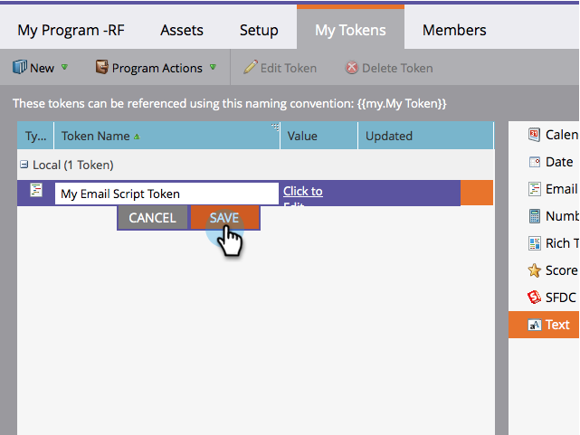

# Skapa en e-postskripttoken {#create-an-email-script-token}

För avancerade utvecklare kan du använda [snabbskript](http://velocity.apache.org/engine/1.7/user-guide.html) i dina e-postmeddelanden. Så här gör du.

1. Gå till **Marknadsföringsaktiviteter**.

   

1. Sök efter och välj ett program (Händelse, Standard eller Förlovning osv.).

   

1. Under fliken **Mina token** drar du i en **e-postskript**-token.

   

1. Namnge din e-postskripttoken och **klicka för att redigera** dess innehåll.

   

1. Använd trädet till höger för att dra i token **Person, Opportunity** eller **Custom Object**.

   

   >[!NOTE]
   >
   >När du använder en array (möjlighet eller anpassat objekt) begränsas du till de senaste 10 objekten som är kopplade till personen.

1. Observera att variabeln blir markerad/aktiv när du har dragit den till skriptredigeraren.

   

   >[!NOTE]
   >
   >**Påminnelse**
   >
   >
   >Om du skriver in tokens i friform måste du kontrollera/aktivera alla motsvarande tokens i trädet, annars behandlas de som oformaterad text och fungerar inte.

1. Skriv ditt skript i Snabbhet. Här är några användbara resurser:

   * [Marketo-utvecklare e-postskriptdokumentation](http://developers.marketo.com/email-scripting/)
   * [Användarhandbok för snabbhet](http://velocity.apache.org/engine/devel/user-guide.html)
   * [Referenshandbok för hastighet](http://velocity.apache.org/engine/devel/vtl-reference-guide.html)
   * [Velocity Tools Javadoc](http://velocity.apache.org/tools/releases/2.0/javadoc/index.html)

1. När skriptet är klart klickar du på **Spara**.

   

1. Klicka på **Spara** en gång till.

   

Nu kan du använda denna token i dina e-postmeddelanden. Skriptet körs varje gång ett e-postmeddelande skickas.

>[!MORELIKETHIS]
>
>* [Lägg till en e-postskripttoken i din e-post](add-an-email-script-token-to-your-email.md)

>

