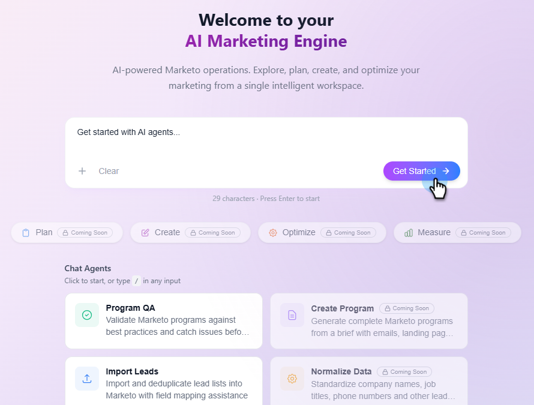

# Marketo Engage AI - översikt {#overview}

Marketo Engage AI har en mängd agenter som är utformade för att automatisera tidskrävande men viktiga marknadsföringsfunktioner.

>[!NOTE]
>
>Den här funktionen är i en öppen betaversion och är för närvarande i en fasad lansering under de kommande månaderna. Du kommer att få veta när det har aktiverats för din prenumeration när du ser en _Build with AI_-platta på din Min Marketo-skärm.

## Åtkomst {#access}

På skärmen My Marketo klickar du på **Build with AI**.

I konversationsgränssnittet finns en uppsättning funktioner för handläggare som är utformade för att automatisera manuella uppgifter som avsevärt förbättrar produktiviteten.

Klicka på knappen **Kom igång** i dialogruteområdet (&quot;_Kom igång med AI-agenter.._&quot; är som standard i kommandotolken).

I mittkonsolen finns sju funktioner för agenter som hjälper dig med olika uppgifter.

## Agenter {#agents}

### Program-QA {#program-qa}

Validera Marketo Engage-programmen mot vedertagna standarder och hitta eventuella problem före lanseringen. [Läs mer](/help/marketo/product-docs/marketo-ai/agents/program-qa.md){target="_blank"}

### Importera leads {#import-leads}

Importera och deduplicera leadlistor till din Marketo Engage-databas med hjälp av fältmappning. [Läs mer](/help/marketo/product-docs/marketo-ai/agents/import-leads.md){target="_blank"}

### Undersök lead (kommer snart) {#investigate-lead}

Upptäck varför någon inte har kvalificerat sig för ett program eller gått igenom livscykeln.

### Plan Program (kommer snart) {#plan-program}

Skapa ett programinställningsdokument som andra kan använda från en kampanjrapport.

### Skapa program (kommer snart) {#create-program}

Generera ett helt Marketo Engage-program med hjälp av en kampanjöversikt, komplett med e-post, landningssida och Smart Campaign.

### Normalisera data (kommer snart) {#normalize-data}

Standardisera fält som företagsnamn, befattning, land med mera.

### Anropbara agenter (kommer snart) {#callable-agents}

Dessa agenter fungerar som webhooks i Marketo Engage Smart Campaigns för databearbetning i realtid.
