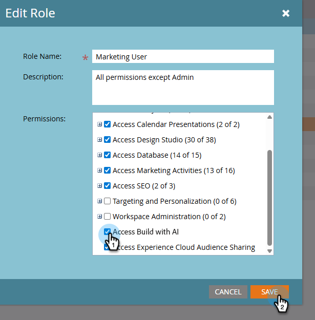

# Inställningar och inställningar {#settings-setup}

Lär dig hur du aktiverar behörigheter och använder området Inställningar för att visa anslutningsinformation, definiera organisationsregler och konfigurera integreringar och meddelanden.

## Behörigheter {#permissions}

>[!IMPORTANT]
>
>I Alpha-fasen av Marketo AI är _åtkomst aktiverad som standard_ för följande roller: Admin, Adobe Product Admin, Marketing User, Standard User. I stället för att aktivera det för roller som du vill ha åtkomst måste du inaktivera det för roller som du inte har.

### Åtkomst för alla {#access-for-all}

Om du vill att Marketo AI ska aktiveras för alla roller ovan behöver du inte göra något.

### Åtkomst för vissa {#access-for-some}

Om du vill ta bort åtkomsten för någon roll följer du stegen nedan.

1. I My Marketo klickar du på **Admin** och sedan på **Användare och roller**.

   

1. Markera önskad roll (eller roller) på fliken _Roller_ och klicka på **Redigera roll**.

   

1. Bläddra nedåt och _avmarkera_ kryssrutan **Åtkomstbygge med AI** och klicka på **Spara**.

   

### Anpassad roll {#custom-role}

Du kan också [skapa en ny roll](https://experienceleague.adobe.com/en/docs/marketo/using/product-docs/administration/users-and-roles/create-delete-edit-and-change-a-user-role#create-a-role){target="_blank"} och anpassa dess behörigheter, lägga till _Access Build med AI_, tillsammans med allt annat du vill ha, och [tilldela den rollen](https://experienceleague.adobe.com/en/docs/marketo/using/product-docs/administration/users-and-roles/managing-user-roles-and-permissions#assign-roles-to-a-user){target="_blank"} till specifika användare.

<!-- ## Permissions {#permissions}

In order to access Marketo AI, Admins must first enable role permissions. 

1. In your My Marketo, click **Admin**, then **Users & Roles**.

   

1. In the _Roles_ tab, select the desired role and click **Edit Role**.

   

1. Scroll down and select the **Access Build with AI** checkbox and click **Save**.

   

-->

## Inställningar {#settings}

1. Klicka på rutan **Bygg med AI** i My Marketo.

   

1. Klicka på kugghjulet.

   

### Anslutning {#connection}

Fliken innehåller inte redigerbara fält. Här visas kontoinformation som ditt Munchkin ID och IMS-företag.

### Organisationsregler {#organizational-rules}

Definiera riktlinjer och begränsningar för organisationen som Marketo AI följer när du skapar eller ändrar Marketo Engage-resurser.

{width="800" zoomable="yes"}

>[!NOTE]
>
>Regler använder Markdown-format med YAML-förhandsgranskning. Globala regler gäller för alla arbetsytor. Workspace-regler åsidosätter globala inställningar.

### Integreringar (kommer snart) {#integrations}

Konfigurera anslutningar till externa tjänster och API:er.

_Den här fliken kan visas i användargränssnittet, men kan ännu inte användas. Kom tillbaka för uppdateringar_.

### Meddelanden (kommer snart) {#notifications}

Hantera aviseringsinställningar och meddelandekanaler.

_Den här fliken kan visas i användargränssnittet, men kan ännu inte användas. Kom tillbaka för uppdateringar_.
