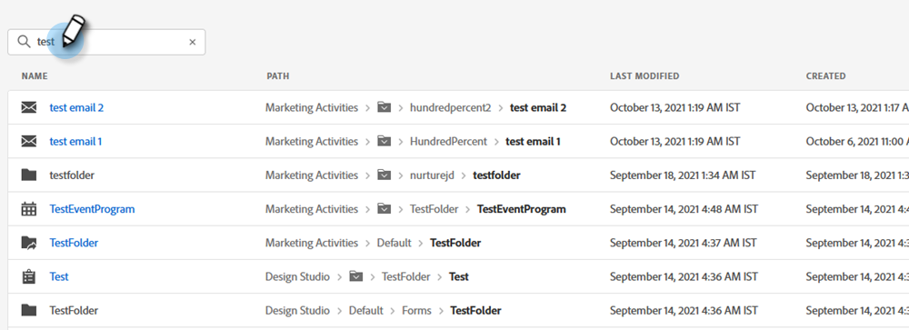
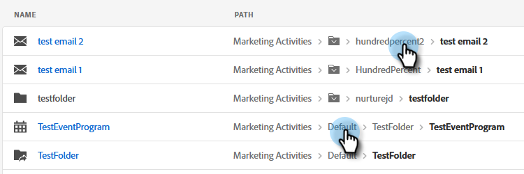
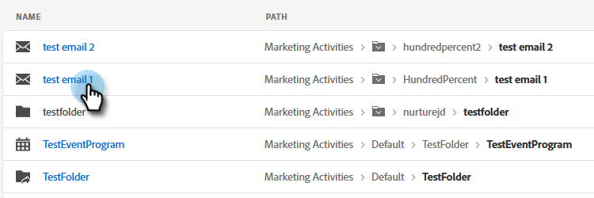

# Använda den globala sökningen {#using-the-global-search}

Den kraftfulla globala sökningen ger dig många alternativ utan någon begränsning av hur resultatet visas.

## Utföra en sökning {#performing-a-search}

1. Klicka på sökikonen i Global Nav.

   

1. Skriv in identifierande text för resursen.

   

1. Sökresultaten visas. Du kan klicka var som helst i de vägbeskrivningar som ska tas direkt till objektet.

   

1. I det här exemplet väljer vi att skickas direkt till det e-postmeddelande vi letar efter. Klicka på e-postens namn.

   

Du dirigeras direkt till önskat e-postmeddelande.

## Sökresultatsida {#search-results-page}

<table> 
 <tbody>
  <tr>
   <td>1</td> 
   <td>Namn på objektet/målet</td> 
  </tr>
  <tr>
   <td>2</td> 
   <td>Sökväg (vägbeskrivningar) till respektive objekt/mål</td> 
  </tr>
  <tr>
   <td>3</td> 
   <td>Datum och tid då objektet/målet senast ändrades</td> 
  </tr>
  <tr>
   <td>4</td> 
   <td>Datum och tid då objektet/målet skapades</td> 
  </tr>
  <tr>
   <td>5</td> 
   <td>Använd fokuserade filter för att begränsa sökresultaten</td> 
  </tr>
 </tbody>
</table>

**VALFRITT STEG**: Välj önskade alternativ om du vill använda filtrering.

