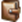
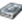

# Ikonordlista {#new-icon-glossary}

Nedan visas ikonerna för det nya gränssnittet Adobe Marketo Engage. Om du behöver referera till Marketo Classic-ikonerna kan de [finnas här](/help/marketo/getting-started/classic-icon-glossary.md).

## Allmänna ikoner {#general-icons}

<table> 
 <tbody>
  <tr>
   <th>Gammal ikon</th> 
   <th> Ny ikon</th> 
   <th>Beskrivning</th> 
  </tr>
  <tr>
   <td><strong>n/a</strong></td> 
   <td></td> 
   <td>Smart lista för konto</td> 
  </tr>
  <tr>
   <td></td> 
   <td></td> 
   <td>Gruppkampanj - aktiv</td> 
  </tr>
  <tr>
   <td></td> 
   <td></td> 
   <td>Gruppkampanj - inaktiv</td> 
  </tr>
  <tr>
   <td></td> 
   <td></td> 
   <td>Standardprogram</td> 
  </tr>
  <tr>
   <td></td> 
   <td></td> 
   <td>E-post</td> 
  </tr>
  <tr>
   <td></td>
   <td></td> 
   <td>E-postprogram</td> 
  </tr>
  <tr>
   <td></td> 
   <td></td> 
   <td>E-postmall</td> 
  </tr>
  <tr>
   <td></td> 
   <td></td> 
   <td>Engagement Program</td> 
  </tr>
  <tr>
   <td></td> 
   <td></td> 
   <td>Event Program</td> 
  </tr>
  <tr>
   <td></td> 
   <td></td> 
   <td>Körbar kampanj</td> 
  </tr>
  <tr>
   <td></td> 
   <td></td> 
   <td>Sorteraren i fält</td> 
  </tr>
  <tr>
   <td></td> 
   <td></td> 
   <td>Filter</td> 
  </tr>
  <tr>
   <td><strong>n/a</strong></td> 
   <td></td> 
   <td>Filter - aktivt</td> 
  </tr>
  <tr>
   <td></td> 
   <td></td> 
   <td>Mapp</td> 
  </tr>
  <tr>
   <td></td> 
   <td></td> 
   <td>Mapp - arkiverad</td> 
  </tr>
  <tr>
   <td></td> 
   <td></td> 
   <td>Mapp - låst</td> 
  </tr>
  <tr>
   <td></td> 
   <td></td> 
   <td>Formulär</td> 
  </tr>
  <tr>
   <td></td> 
   <td></td> 
   <td>Bilder (och filer)</td> 
  </tr>
  <tr>
   <td></td> 
   <td></td> 
   <td>Meddelanden i appen</td> 
  </tr>
  <tr>
   <td></td> 
   <td></td> 
   <td>Program i appen</td> 
  </tr>
  <tr>
   <td></td> 
   <td></td> 
   <td>Landningssida</td> 
  </tr>
  <tr>
   <td></td> 
   <td></td> 
   <td>Landningssidmall</td> 
  </tr>
  <tr>
   <td></td> 
   <td></td> 
   <td>Modell</td> 
  </tr>
  <tr>
   <td></td> 
   <td></td> 
   <td>Röstning</td> 
  </tr>
  <tr>
   <td></td> 
   <td></td> 
   <td>Push-meddelande</td> 
  </tr>
  <tr>
   <td></td> 
   <td></td> 
   <td>Värvningserbjudande</td> 
  </tr>
  <tr>
   <td></td> 
   <td></td> 
   <td>Rapport</td> 
  </tr>
  <tr>
   <td><strong>n/a</strong></td> 
   <td></td> 
   <td>Sök</td> 
  </tr>
  <tr>
   <td></td> 
   <td></td> 
   <td>Segment</td> 
  </tr>
  <tr>
   <td></td> 
   <td></td> 
   <td>Smart List</td> 
  </tr>
  <tr>
   <td></td> 
   <td></td> 
   <td>Smart List - cachelagrad</td> 
  </tr>
  <tr>
   <td></td> 
   <td></td> 
   <td>SMS-meddelande</td> 
  </tr>
  <tr>
   <td></td> 
   <td></td> 
   <td>Fragment</td> 
  </tr>
  <tr>
   <td></td> 
   <td></td> 
   <td>Knappen Socialt</td> 
  </tr>
  <tr>
   <td></td> 
   <td></td> 
   <td>Statisk lista</td> 
  </tr>
  <tr>
   <td></td> 
   <td></td> 
   <td>Dragningar</td> 
  </tr>
  <tr>
   <td></td> 
   <td></td> 
   <td>Testgrupp</td> 
  </tr>
  <tr>
   <td></td> 
   <td></td> 
   <td>Utlösare - aktiv</td> 
  </tr>
  <tr>
   <td><strong>n/a</strong></td> 
   <td></td> 
   <td>Utlösare - inaktiv</td> 
  </tr>
  <tr>
   <td></td> 
   <td></td> 
   <td>Arbetsyta</td> 
  </tr>
  <tr>
   <td></td> 
   <td></td> 
   <td>YouTube Video</td> 
  </tr>
 </tbody>
</table>

## Gruppkampanjer {#batch-campaigns}

<table> 
 <tbody>
  <tr>
   <th>Gammal ikon</th> 
   <th> Ny ikon</th> 
   <th>Beskrivning</th> 
  </tr>
  <tr>
   <td></td> 
   <td></td> 
   <td>Har körts, inga kommande</td> 
  </tr>
  <tr>
   <td></td> 
   <td></td> 
   <td>Ogiltig</td> 
  </tr>
  <tr>
   <td></td> 
   <td></td> 
   <td>Kör aldrig</td> 
  </tr>
  <tr>
   <td></td> 
   <td></td> 
   <td>Körs, i vänteläge</td> 
  </tr>
  <tr>
   <td></td> 
   <td></td> 
   <td>Schemalagd att köras</td> 
  </tr>
  <tr>
   <td></td> 
   <td></td> 
   <td>Schemalagd att köras igen</td> 
  </tr>
  <tr>
   <td></td> 
   <td></td> 
   <td>Används av struktur</td> 
  </tr>
 </tbody>
</table>

## Utlösarkampanjer {#trigger-campaigns}

<table> 
 <tbody>
  <tr>
   <th>Gammal ikon</th> 
   <th> Ny ikon</th> 
   <th>Beskrivning</th> 
  </tr>
  <tr>
   <td></td> 
   <td></td> 
   <td>Aktiv</td> 
  </tr>
  <tr>
   <td></td> 
   <td></td> 
   <td>Begärd</td> 
  </tr>
  <tr>
   <td><strong>n/a</strong></td> 
   <td></td> 
   <td>Inaktiv</td> 
  </tr>
  <tr>
   <td></td> 
   <td></td> 
   <td>Ogiltig</td> 
  </tr>
 </tbody>
</table>

## E-postprogram {#email-programs}

<table> 
 <tbody>
  <tr>
   <th>Gammal ikon</th> 
   <th> Ny ikon</th> 
   <th>Beskrivning</th> 
  </tr>
  <tr>
   <td></td> 
   <td></td> 
   <td>Avbruten</td> 
  </tr>
  <tr>
   <td></td> 
   <td></td> 
   <td>Slutförd</td> 
  </tr>
  <tr>
   <td></td> 
   <td></td> 
   <td>Inte godkänt</td> 
  </tr>
  <tr>
   <td></td> 
   <td></td> 
   <td>Schemalagd</td> 
  </tr>
 </tbody>
</table>

## Engagement Programs {#engagement-programs}

<table> 
 <tbody>
  <tr>
   <th>Gammal ikon</th> 
   <th> Ny ikon</th> 
   <th>Beskrivning</th> 
  </tr>
  <tr>
   <td></td> 
   <td></td> 
   <td>Av</td> 
  </tr>
  <tr>
   <td></td> 
   <td></td> 
   <td>På</td> 
  </tr>
 </tbody>
</table>

## Program i appen {#in-app-programs}

<table> 
 <tbody>
  <tr>
   <th>Gammal ikon</th> 
   <th> Ny ikon</th> 
   <th>Beskrivning</th> 
  </tr>
  <tr>
   <td></td> 
   <td></td> 
   <td>Godkänd</td> 
  </tr>
  <tr>
   <td></td> 
   <td></td> 
   <td>Inte konfigurerad ännu</td> 
  </tr>
  <tr>
   <td></td> 
   <td></td> 
   <td>Pausad</td> 
  </tr>
  <tr>
   <td><strong>n/a</strong></td> 
   <td></td> 
   <td>Schemalagd</td> 
  </tr>
  <tr>
   <td></td> 
   <td></td> 
   <td>Stoppad</td> 
  </tr>
 </tbody>
</table>

## Resurser {#assets}

<table> 
 <tbody>
  <tr>
   <th>Gammal ikon</th> 
   <th> Ny ikon</th> 
   <th>Beskrivning</th> 
  </tr>
  <tr>
   <td></td> 
   <td></td> 
   <td>Godkänd</td> 
  </tr>
  <tr>
   <td></td> 
   <td></td> 
   <td>Utkast</td> 
  </tr>
  <tr>
   <td></td> 
   <td></td> 
   <td>Godkänd med utkast</td> 
  </tr>
 </tbody>
</table>

## Segment {#segments}

<table> 
 <tbody>
  <tr>
   <th>Gammal ikon</th> 
   <th> Ny ikon</th> 
   <th>Beskrivning</th> 
  </tr>
  <tr>
   <td><strong>n/a</strong></td> 
   <td></td> 
   <td>Godkänd - under beräkning</td> 
  </tr>
  <tr>
   <td><strong>n/a</strong></td> 
   <td></td> 
   <td>Godkänd - under omberäkning</td> 
  </tr>
  <tr>
   <td><strong>n/a</strong></td> 
   <td></td> 
   <td>Utkast - under beräkning</td> 
  </tr>
 </tbody>
</table>
