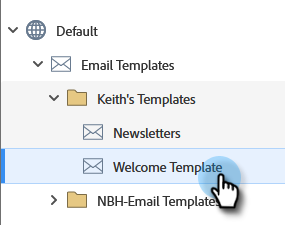

# Växla av/på {#toggle-switch}

Med växeln Växla kan du växla mellan Marketo klassiska gränssnitt och nästa generations Marketo Engage. Den är tillgänglig i alla områden som markeras nedan. Från och med majversionen 2022 kommer nästa generations upplevelse att aktiveras som standard.

>[!NOTE]
>
>När Växla växel är markerat sparas alla befintliga arbetsflöden automatiskt innan gränssnittsändringen inträffar. Om en åtgärd redan pågår (t.ex.: om en resurs håller på att godkännas) får du ett felmeddelande som anger att den är sådan och bör försöka igen när åtgärden har slutförts.

## Aktivera växeln Växla för enskilda roller {#enable-the-toggle-switch-for-individual-roles}

Aktivera växlingsknappen för enskilda roller eller för alla roller. Så här gör du.

1. Klicka på Marketo Engage **Administratör**.

   

1. Klicka **Ny upplevelse**.

   

1. Välj den eller de roller som du vill ska ha tillgång till växlingsknappen.

   

## Visa lista över landningssidor {#landing-page-list-view}

I listvyn för nästa generations landningssida finns sökfilter och möjlighet att utföra åtgärder för en landningssida.

1. I Marketo väljer du **Design Studio**.

   

1. Välj **Landningssidor**.

   

1. Klicka på knappen längst ned till höger på sidan **Ny upplevelse** växla.

   

Den nya upplevelsen läses in.

## Detaljvy för landningssida {#landing-page-details-view}

1. I Marketo söker du efter och väljer din landningssida.

   

1. Klicka på knappen längst ned till höger på sidan **Ny upplevelse** växla.

   

Den nya upplevelsen läses in.

## Formulärinformationssida {#form-details-page}

1. I Marketo söker du efter och markerar ditt formulär.

   

1. Klicka på knappen längst ned till höger på sidan **Ny upplevelse** växla.

   

Den nya upplevelsen läses in.

## Vy för formulärlista {#form-list-view}

1. I Marketo väljer du **Design Studio**.

   

1. Välj **Forms**.

   

1. Klicka på knappen längst ned till höger på sidan **Ny upplevelse** växla.

   

Den nya upplevelsen läses in.

## Vyn Information om e-postmall {#email-template-details-view}

1. I Marketo väljer du **Design Studio**.

   

1. Välj önskad e-postmall.

   

1. Klicka på knappen längst ned till höger på sidan **Ny upplevelse** växla.

   

Den nya upplevelsen läses in.

## Vyn E-postinformation {#email-details-view}

1. I Marketo söker du efter och väljer e-post.

   

1. Klicka på knappen längst ned till höger på sidan **Ny upplevelse** växla.

   

Den nya upplevelsen läses in.

## Visa e-postlista {#email-list-view}

I nästa generations e-postlistvy finns sökfilter och möjlighet att utföra massåtgärder via e-post.

1. I Marketo väljer du **Design Studio**.

   

1. Välj **E-post**.

   

1. Klicka på knappen längst ned till höger på sidan **Ny upplevelse** växla.

   

Den nya upplevelsen läses in.

## Aktivera för alla funktioner {#enable-for-all-features}

Du kan manuellt aktivera Marketo nästa generations gränssnitt för alla tillgängliga funktioner, aktuella och kommande.

1. I ett område som för närvarande har växeln Växla (i det här exemplet är vi i [Formulärinformationssida](#form-details-page)) klickar du på kugghjulsikonen längst ned till höger på sidan.

   

1. Välj **Aktivera för alla tillgängliga funktioner** och klicka **OK**.

   
